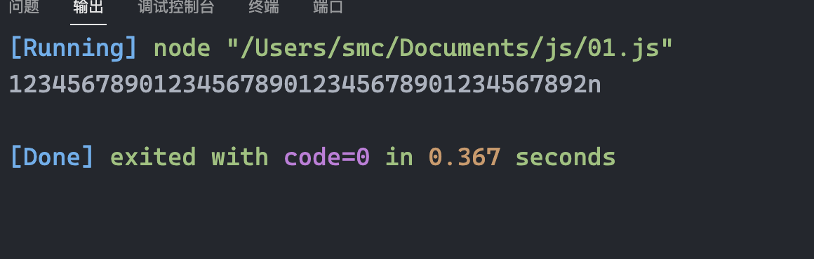
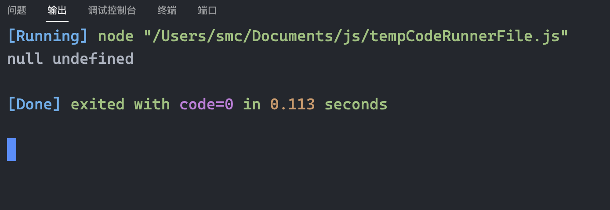

[TOC]


# 数据类型

## `BigInt`类型

在 JavaScript 中，“number” 类型无法安全地表示大于 `(253-1)`（即 `9007199254740991`），或小于 `-(253-1)` 的整数。也就是说，所有大于 `(253-1)` 的奇数都不能用 “number” 类型存储。

在大多数情况下，`±(253-1)` 范围就足够了，但有时候我们需要整个范围非常大的整数，例如用于密码学或微秒精度的时间戳。

`BigInt` 类型是最近被添加到 JavaScript 语言中的，用于表示任意长度的整数。

可以通过将 `n` 附加到整数字段的末尾来创建 `BigInt` 值。

```js
// 尾部的 "n" 表示这是一个 BigInt 类型
const bigInt = 1234567890123456789012345678901234567890n;
```

*大数运算只能是两个大数之间的运算,一个大数与另一个非大数运算的话就会报错*

```js
const bigInt = 1234567890123456789012345678901234567890n
console.log(bigInt + 2)
```


```js
const bigInt = 1234567890123456789012345678901234567890n
console.log(bigInt + 2n)
```




## `undefined`与`null`的区别

`null`不属于任何一种类型,它构成了一个独立的类型，只包含 `null` 值.相比较于其他编程语言，JavaScript 中的 `null` 不是一个“对不存在的 `object` 的引用”或者 “null 指针”.JavaScript 中的 `null` 仅仅是一个代表“无”、“空”或“值未知”的特殊值。

特殊值 `undefined` 和 `null` 一样自成类型。`undefined` 的含义是**未被赋值**。如果一个变量已被声明，但未被赋值，那么它的值就是 `undefined`

```js
let age = null

let age2

console.log(age, age2)
```



通常，使用 `null` 将一个“空”或者“未知”的值写入变量中，而 `undefined` 则保留作为未进行初始化的事物的默认初始值。


## `typeof`运算符

`typeof` 运算符返回参数的类型。当我们想要分别处理不同类型值的时候，或者想快速进行数据类型检验时，非常有用。

```js
typeof undefined // "undefined"

typeof 0 // "number"

typeof 10n // "bigint"

typeof true // "boolean"

typeof "foo" // "string"

typeof Symbol("id") // "symbol"

typeof Math // "object"  (1)

typeof null // "object"  (2)

typeof alert // "function"  (3)
```

> 最后三行可能需要额外的说明：
>
> 1. `Math` 是一个提供数学运算的内建 `object`。我们会在 [数字类型](https://zh.javascript.info/number) 一节中学习它。此处仅作为一个 `object` 的示例。
> 2. `typeof null` 的结果为 `"object"`。这是官方承认的 `typeof` 的错误，这个问题来自于 JavaScript 语言的早期阶段，并为了兼容性而保留了下来。`null` 绝对不是一个 `object`。`null` 有自己的类型，它是一个特殊值。`typeof` 的行为在这里是错误的。
> 3. `typeof alert` 的结果是 `"function"`，因为 `alert` 在 JavaScript 语言中是一个函数。我们会在下一章学习函数，那时我们会了解到，在 JavaScript 语言中没有一个特别的 “function” 类型。函数隶属于 `object` 类型。但是 `typeof` 会对函数区分对待，并返回 `"function"`。这也是来自于 JavaScript 语言早期的问题。从技术上讲，这种行为是不正确的，但在实际编程中却非常方便。


## 总结

JavaScript 中有八种基本的数据类型（译注：前七种为基本数据类型，也称为原始数据类型，而 `object` 为复杂数据类型）。

- 七种原始数据类型：
  - `number` 用于任何类型的数字：整数或浮点数，在 `±(253-1)` 范围内的整数。
  - `bigint` 用于任意长度的整数。
  - `string` 用于字符串：一个字符串可以包含 0 个或多个字符，所以没有单独的单字符类型。
  - `boolean` 用于 `true` 和 `false`。
  - `null` 用于未知的值 —— 只有一个 `null` 值的独立类型。
  - `undefined` 用于未定义的值 —— 只有一个 `undefined` 值的独立类型。
  - `symbol` 用于唯一的标识符。
- 以及一种非原始数据类型：
  - `object` 用于更复杂的数据结构。

我们可以通过 `typeof` 运算符查看存储在变量中的数据类型。

- 通常用作 `typeof x`，但 `typeof(x)` 也可行。
- 以==字符串==的形式返回类型名称，例如 `"string"`。
- `typeof null` 会返回 `"object"` —— 这是 JavaScript 编程语言的一个错误，实际上它并不是一个 `object`。


# 类型转换

字符串中,有些是隐性转换,比如说`alert(value)` 将 `value` 转换为字符串类型，然后显示这个值。还有显式转换,调用 `String(value)` 来将 `value` 转换为字符串类型：

数字转换与字符串类似,也可以使用 `Number(value)` 显式地将这个 `value` 转换为 number 类型。

```js
let value = true;
alert(typeof value); // boolean

value = String(value); // 现在，值是一个字符串形式的 "true"
alert(typeof value); // string


let str = "123";
alert(typeof str); // string

let num = Number(str); // 变成 number 类型 123

alert(typeof num); // number
```

**`null` 和 `undefined` 在这有点不同：`null` 变成数字 `0`，`undefined` 变成 `NaN`。**


## 总结

有三种常用的类型转换：转换为 string 类型、转换为 number 类型和转换为 boolean 类型。

**字符串转换** —— 转换发生在输出内容的时候，也可以通过 `String(value)` 进行显式转换。原始类型值的 string 类型转换通常是很明显的。

**数字型转换** —— 转换发生在进行算术操作时，也可以通过 `Number(value)` 进行显式转换。

数字型转换遵循以下规则：

| 值             | 变成……                                                       |
| :------------- | :----------------------------------------------------------- |
| `undefined`    | `NaN`                                                        |
| `null`         | `0`                                                          |
| `true / false` | `1 / 0`                                                      |
| `string`       | “按原样读取”字符串，两端的空白字符（空格、换行符 `\n`、制表符 `\t` 等）会被忽略。空字符串变成 `0`。转换出错则输出 `NaN`。 |

**布尔型转换** —— 转换发生在进行逻辑操作时，也可以通过 `Boolean(value)` 进行显式转换。

布尔型转换遵循以下规则：

| 值                                    | 变成……  |
| :------------------------------------ | :------ |
| `0`, `null`, `undefined`, `NaN`, `""` | `false` |
| 其他值                                | `true`  |

上述的大多数规则都容易理解和记忆。人们通常会犯错误的值得注意的例子有以下几个：

- 对 `undefined` 进行数字型转换时，输出结果为 `NaN`，而非 `0`。
- 对 `"0"` 和只有空格的字符串（比如：`" "`）进行布尔型转换时，输出结果为 `true`。


# 值的比较

## 对`null`和`undefind`的比较:

当使用 `null` 或 `undefined` 与其他值进行比较时，其返回结果常常出乎你的意料。

- 当使用严格相等 `===` 比较二者时

  它们不相等，因为它们属于不同的类型。

  ```js
  alert( null === undefined ); // false
  ```

- 当使用非严格相等 `==` 比较二者时

  JavaScript 存在一个特殊的规则，会判定它们相等。它们俩就像“一对恋人”，仅仅等于对方而不等于其他任何的值（只在非严格相等下成立）。

  ```js
  alert( null == undefined ); // true
  ```

- 当使用数学式或其他比较方法 `< > <= >=` 时：

  `null/undefined` 会被转化为数字：`null` 被转化为 `0`，`undefined` 被转化为 `NaN`。


## `null`与`0`的比较

```js
alert( null > 0 );  // (1) false
alert( null == 0 ); // (2) false
alert( null >= 0 ); // (3) true
```

为什么会出现这种反常结果，这是因为相等性检查 `==` 和普通比较符 `> < >= <=` 的代码逻辑是相互独立的。进行值的比较时，`null` 会被转化为数字，因此它被转化为了 `0`。这就是为什么（3）中 `null >= 0` 返回值是 true，（1）中 `null > 0` 返回值是 false。

另一方面，`undefined` 和 `null` 在相等性检查 `==` 中不会进行任何的类型转换，它们有自己独立的比较规则，所以除了它们之间互等外，不会等于任何其他的值。这就解释了为什么（2）中 `null == 0` 会返回 false。


## 特立独行的`undefind`

`undefined` 不应该被与其他值进行比较：

```js
alert( undefined > 0 ); // false (1)
alert( undefined < 0 ); // false (2)
alert( undefined == 0 ); // false (3)
```

- `(1)` 和 `(2)` 都返回 `false` 是因为 `undefined` 在比较中被转换为了 `NaN`，而 `NaN` 是一个特殊的数值型值，它与任何值进行比较都会返回 `false`。
- `(3)` 返回 `false` 是因为这是一个相等性检查，而 `undefined` 只与 `null` 相等，不会与其他值相等。

>  因此,在值的比较中,`> < >= <=`与`== ===`这两类是不同的,普通比较符会进行转换,而相等性检查不会
>
> ```js
> console.log('1' == 1) // true
> console.log('1' === 1) // false
> console.log(NaN == NaN) // false
> console.log(NaN === NaN) // false
> console.log(undefined == null) // true
> console.log(undefined === null) // false
> ```

## 总结

- 比较运算符始终返回布尔值。
- 字符串的比较，会按照“词典”顺序逐字符地比较大小。
- 当对不同类型的值进行比较时，它们会先被转化为数字（不包括严格相等检查）再进行比较。
- 在非严格相等 `==` 下，`null` 和 `undefined` 相等且各自不等于任何其他的值。
- 在使用 `>` 或 `<` 进行比较时，需要注意变量可能为 `null/undefined` 的情况。比较好的方法是单独检查变量是否等于 `null/undefined`。


# 空值合并运算符 '??'

> **最近新增的特性**
>
> 这是一个最近添加到 JavaScript 的特性。 旧式浏览器可能需要 polyfills.

空值合并运算符（nullish coalescing operator）的写法为两个问号 `??`。

`a ?? b` 的结果是：

- 如果 `a` 是已定义的，则结果为 `a`，
- 如果 `a` 不是已定义的，则结果为 `b`。

换句话说，如果第一个参数不是 `null/undefined`，则 `??` 返回第一个参数。否则，返回第二个参数。

空值合并运算符并不是什么全新的东西。它只是一种获得两者中的第一个“已定义的”值的不错的语法。

我们可以使用我们已知的运算符重写 `result = a ?? b`，像这样：

```js
result = (a !== null && a !== undefined) ? a : b;
```


## 优先级

`??` 运算符的优先级与 `||` 相同，它们的的优先级都为 `4`，详见：[MDN](https://developer.mozilla.org/en-US/docs/Web/JavaScript/Reference/Operators/Operator_Precedence#Table)。

这意味着，就像 `||` 一样，空值合并运算符在 `=` 和 `?` 运算前计算，但在大多数其他运算（例如 `+` 和 `*`）之后计算。

所以我们可能需要在这样的表达式中添加括号：

```javascript
let height = null;
let width = null;

// 重要：使用括号
let area = (height ?? 100) * (width ?? 50);

alert(area); // 5000
```

出于安全原因，JavaScript 禁止将 `??` 运算符与 `&&` 和 `||` 运算符一起使用，除非使用括号明确指定了优先级。


## 总结

- 空值合并运算符 `??` 提供了一种从列表中选择第一个“已定义的”值的简便方式。

  它被用于为变量分配默认值：

  ```javascript
  // 当 height 的值为 null 或 undefined 时，将 height 的值设置为 100
  height = height ?? 100;
  ```

- `??` 运算符的优先级非常低，仅略高于 `?` 和 `=`，因此在表达式中使用它时请考虑添加括号。

- 如果没有明确添加括号，不能将其与 `||` 或 `&&` 一起使用。


# 函数

## 空值的 `return` 或没有 `return` 的函数返回值为 `undefined`

如果函数无返回值，它就会像返回 `undefined` 一样：

```javascript
function doNothing() { /* 没有代码 */ }

console.log( doNothing() === undefined ); // true
```

空值的 `return` 和 `return undefined` 等效：

```javascript
function doNothing() {
  return;
}

console.log( doNothing() === undefined ); // true
```


## 不要在 `return` 与返回值之间添加新行

对于 `return` 的长表达式，可能你会很想将其放在单独一行，如下所示：

```javascript
return
 (some + long + expression + or + whatever * f(a) + f(b))
```

但这不行，因为 JavaScript 默认会在 `return` 之后加上分号。上面这段代码和下面这段代码运行流程相同：

```javascript
return;
 (some + long + expression + or + whatever * f(a) + f(b))
```

因此，实际上它的返回值变成了空值。

如果我们想要将返回的表达式写成跨多行的形式，那么应该在 `return` 的同一行开始写此表达式。或者至少按照如下的方式放上左括号：

```javascript
return (
  some + long + expression
  + or +
  whatever * f(a) + f(b)
  )
```

然后它就能像我们预想的那样正常运行了。


## 总结

函数声明方式如下所示：

```javascript
function name(parameters, delimited, by, comma) {
  /* code */
}
```

- 作为参数传递给函数的值，会被复制到函数的局部变量。
- 函数可以访问外部变量。但它只能从内到外起作用。函数外部的代码看不到函数内的局部变量。
- 函数可以返回值。如果没有返回值，则其返回的结果是 `undefined`。

为了使代码简洁易懂，建议在函数中主要使用局部变量和参数，而不是外部变量。

与不获取参数但将修改外部变量作为副作用的函数相比，获取参数、使用参数并返回结果的函数更容易理解。

函数命名：

- 函数名应该清楚地描述函数的功能。当我们在代码中看到一个函数调用时，一个好的函数名能够让我们马上知道这个函数的功能是什么，会返回什么。
- 一个函数是一个行为，所以函数名通常是动词。
- 目前有许多优秀的函数名前缀，如 `create…`、`show…`、`get…`、`check…` 等等。使用它们来提示函数的作用。

函数是脚本的主要构建块。现在我们已经介绍了基本知识，现在我们就可以开始创建和使用函数了。但这只是学习和使用函数的开始。我们将继续学习更多函数的相关知识，更深入地研究它们的先进特征


# 对象基础

## 移除属性

可以用 `delete` 操作符移除属性：

```js
delete user.age
```


## 属性值简写

属性名跟变量名一样。这种通过变量生成属性的应用场景很常见，在这有一种特殊的 **属性值缩写** 方法，使属性名变得更短。

可以用 `name` 来代替 `name:name` 像下面那样：

```js
function makeUser(name, age) {
  return {
    name, // 与 name: name 相同
    age,  // 与 age: age 相同
    // ...
  };
}
```


## 属性存在性测试，`in`操作符

相比于其他语言，JavaScript 的对象有一个需要注意的特性：能够被访问任何属性。即使属性不存在也不会报错！

读取不存在的属性只会得到 `undefined`。所以我们可以很容易地判断一个属性是否存在：

```javascript
let user = {};

alert( user.noSuchProperty === undefined ); // true 意思是没有这个属性
```

这里还有一个特别的，检查属性是否存在的操作符 `"in"`。

语法是：

```javascript
"key" in object
```

例如：

```javascript
let user = { name: "John", age: 30 };

alert( "age" in user ); // true，user.age 存在
alert( "blabla" in user ); // false，user.blabla 不存在。
```

请注意，`in` 的左边必须是 **属性名**。通常是一个带引号的字符串。

如果我们省略引号，就意味着左边是一个变量，它应该包含要判断的实际属性名。例如：

```javascript
let user = { age: 30 };

let key = "age";
alert( key in user ); // true，属性 "age" 存在
```

为何会有 `in` 运算符呢？与 `undefined` 进行比较来判断还不够吗？

确实，大部分情况下与 `undefined` 进行比较来判断就可以了。但有一个例外情况，这种比对方式会有问题，但 `in` 运算符的判断结果仍是对的。

那就是属性存在，但存储的值是 `undefined` 的时候：

```javascript
let obj = {
  test: undefined
};

alert( obj.test ); // 显示 undefined，所以属性不存在？

alert( "test" in obj ); // true，属性存在！
```


## `for in`循环

为了遍历一个对象的所有键（key），可以使用一个特殊形式的循环：`for..in`。这跟我们在前面学到的 `for(;;)` 循环是完全不一样的东西。

语法：

```javascript
for (key in object) {
  // 对此对象属性中的每个键执行的代码
}
```

例如，让我们列出 `user` 所有的属性：

```javascript
let user = {
  name: "John",
  age: 30,
  isAdmin: true
};

for (let key in user) {
  // keys
  alert( key );  // name, age, isAdmin
  // 属性键的值
  alert( user[key] ); // John, 30, true
}
```

注意，所有的 “for” 结构体都允许我们在循环中定义变量，像这里的 `let key`。

同样，我们可以用其他属性名来替代 `key`。例如 `"for(let prop in obj)"` 也很常用。


## 像对象一样排序

对象有顺序吗？换句话说，如果我们遍历一个对象，我们获取属性的顺序是和属性添加时的顺序相同吗？这靠谱吗？

简短的回答是：“有特别的顺序”：整数属性会被进行排序，其他属性则按照创建的顺序显示。详情如下：

例如，让我们考虑一个带有电话号码的对象：

```javascript
let codes = {
  "49": "Germany",
  "41": "Switzerland",
  "44": "Great Britain",
  // ..,
  "1": "USA"
};

for(let code in codes) {
  alert(code); // 1, 41, 44, 49
}
```

对象可用于面向用户的建议选项列表。如果我们的网站主要面向德国观众，那么我们可能希望 `49` 排在第一。

但如果我们执行代码，会看到完全不同的现象：

- USA (1) 排在了最前面
- 然后是 Switzerland (41) 及其它。

因为这些电话号码是整数，所以它们以升序排列。所以我们看到的是 `1, 41, 44, 49`。

此外，如果属性名不是整数，那它们就按照创建时的顺序来排序，例如：

```javascript
let user = {
  name: "John",
  surname: "Smith"
};
user.age = 25; // 增加一个

// 非整数属性是按照创建的顺序来排列的
for (let prop in user) {
  alert( prop ); // name, surname, age
}
```

所以，为了解决电话号码的问题，我们可以使用非整数属性名来 **欺骗** 程序。只需要给每个键名加一个加号 `"+"` 前缀就行了。

像这样：

```javascript
let codes = {
  "+49": "Germany",
  "+41": "Switzerland",
  "+44": "Great Britain",
  // ..,
  "+1": "USA"
};

for (let code in codes) {
  alert( +code ); // 49, 41, 44, 1
}
```

现在跟预想的一样了。


## 总结

对象是具有一些特殊特性的关联数组。

它们存储属性（键值对），其中：

- 属性的键必须是字符串或者 symbol（通常是字符串）。
- 值可以是任何类型。

我们可以用下面的方法访问属性：

- 点符号: `obj.property`。
- 方括号 `obj["property"]`，方括号允许从变量中获取键，例如 `obj[varWithKey]`。

其他操作：

- 删除属性：`delete obj.prop`。
- 检查是否存在给定键的属性：`"key" in obj`。
- 遍历对象：`for(let key in obj)` 循环。

我们在这一章学习的叫做“普通对象（plain object）”，或者就叫对象。

JavaScript 中还有很多其他类型的对象：

- `Array` 用于存储有序数据集合，
- `Date` 用于存储时间日期，
- `Error` 用于存储错误信息。
- ……等等。

它们有着各自特别的特性，我们将在后面学习到。有时候大家会说“Array 类型”或“Date 类型”，但其实它们并不是自身所属的类型，而是属于一个对象类型即 “object”。它们以不同的方式对 “object” 做了一些扩展。


# 对象引用和复制

对象与原始类型的根本区别之一是，对象是“通过引用”存储和复制的，而原始类型：字符串、数字、布尔值等 —— 总是“作为一个整体”复制。

让我们从原始类型开始，例如一个字符串。

这里我们将 `message` 复制到 `phrase`：

```javascript
let message = "Hello!";
let phrase = message;
```

结果我们就有了两个独立的变量，每个都存储着字符串 `"Hello!"`。


但是，对象不是这样的。

**赋值了对象的变量存储的不是对象本身，而是该对象“在内存中的地址” —— 换句话说就是对该对象的“引用”。**

让我们看一个这样的变量的例子：

```javascript
let user = {
  name: "John"
};
```

这是它实际存储在内存中的方式：


该对象被存储在内存中的某个位置（在图片的右侧），而变量 `user`（在左侧）保存的是对其的“引用”。

我们可以将一个对象变量（例如 `user`）想象成一张写有对象的地址的纸。

当我们对对象执行操作时，例如获取一个属性 `user.name`，JavaScript 引擎会查看该地址中的内容，并在实际对象上执行操作。

现在，这就是为什么它很重要。

**当一个对象变量被复制 —— 引用被复制，而该对象自身并没有被复制。**

例如：

```javascript
let user = { name: "John" };

let admin = user; // 复制引用
```

现在我们有了两个变量，它们保存的都是对同一个对象的引用：


这里仍然只有一个对象，但现在有两个引用它的变量。

我们可以通过其中任意一个变量来访问该对象并修改它的内容：

```javascript
let user = { name: 'John' };

let admin = user;

admin.name = 'Pete'; // 通过 "admin" 引用来修改

alert(user.name); // 'Pete'，修改能通过 "user" 引用看到
```

这就像我们有一个带有两把钥匙的柜子，使用其中一把钥匙（`admin`）打开柜子并更改了里面的东西。那么，如果我们稍后用另一把钥匙（`user`），我们仍然可以打开同一个柜子并且可以访问更改的内容。


## 通过引用来比较

仅当两个对象为同一对象时，两者才相等。

例如，这里 `a` 和 `b` 两个变量都引用同一个对象，所以它们相等：

```javascript
let a = {};
let b = a; // 复制引用

alert( a == b ); // true，都引用同一对象
alert( a === b ); // true
```

而这里两个独立的对象则并不相等，即使它们看起来很像（都为空）：

```javascript
let a = {};
let b = {}; // 两个独立的对象

alert( a == b ); // false
```

对于类似 `obj1 > obj2` 的比较，或者跟一个原始类型值的比较 `obj == 5`，对象都会被转换为原始值。我们很快就会学到对象是如何转换的，但是说实话，很少需要进行这样的比较 —— 通常是在编程错误的时候才会出现这种情况。


## 克隆与合并，Object.assign

那么，拷贝一个对象变量会又创建一个对相同对象的引用。

但是，如果我们想要复制一个对象，那该怎么做呢？

我们可以创建一个新对象，通过遍历已有对象的属性，并在原始类型值的层面复制它们，以实现对已有对象结构的复制。

就像这样：

```javascript
let user = {
  name: "John",
  age: 30
};

let clone = {}; // 新的空对象

// 将 user 中所有的属性拷贝到其中
for (let key in user) {
  clone[key] = user[key];
}

// 现在 clone 是带有相同内容的完全独立的对象
clone.name = "Pete"; // 改变了其中的数据

alert( user.name ); // 原来的对象中的 name 属性依然是 John
```

我们也可以使用 [Object.assign](https://developer.mozilla.org/en-US/docs/Web/JavaScript/Reference/Global_Objects/Object/assign) 方法来达成同样的效果。

语法是：

```javascript
Object.assign(dest, [src1, src2, src3...])
```

- 第一个参数 `dest` 是指目标对象。
- 更后面的参数 `src1, ..., srcN`（可按需传递多个参数）是源对象。
- 该方法将所有源对象的属性拷贝到目标对象 `dest` 中。换句话说，从第二个开始的所有参数的属性都被拷贝到第一个参数的对象中。
- 调用结果返回 `dest`。

例如，我们可以用它来合并多个对象：

```javascript
let user = { name: "John" };

let permissions1 = { canView: true };
let permissions2 = { canEdit: true };

// 将 permissions1 和 permissions2 中的所有属性都拷贝到 user 中
Object.assign(user, permissions1, permissions2);

// 现在 user = { name: "John", canView: true, canEdit: true }
```

如果被拷贝的属性的属性名已经存在，那么它会被覆盖：

```javascript
let user = { name: "John" };

Object.assign(user, { name: "Pete" });

alert(user.name); // 现在 user = { name: "Pete" }
```

我们也可以用 `Object.assign` 代替 `for..in` 循环来进行简单克隆：

```javascript
let user = {
  name: "John",
  age: 30
};

let clone = Object.assign({}, user);
```

它将 `user` 中的所有属性拷贝到了一个空对象中，并返回这个新的对象。

还有其他克隆对象的方法，例如使用 [spread 语法](https://zh.javascript.info/rest-parameters-spread) `clone = {...user}`，在后面的章节中我们会讲到。


## 深层克隆

到现在为止，我们都假设 `user` 的所有属性均为原始类型。但属性可以是对其他对象的引用。

例如：

```javascript
let user = {
  name: "John",
  sizes: {
    height: 182,
    width: 50
  }
};

alert( user.sizes.height ); // 182
```

现在这样拷贝 `clone.sizes = user.sizes` 已经不足够了，因为 `user.sizes` 是个对象，它会以引用形式被拷贝。因此 `clone` 和 `user` 会共用一个 sizes：

```javascript
let user = {
  name: "John",
  sizes: {
    height: 182,
    width: 50
  }
};

let clone = Object.assign({}, user);

alert( user.sizes === clone.sizes ); // true，同一个对象

// user 和 clone 分享同一个 sizes
user.sizes.width++;       // 通过其中一个改变属性值
alert(clone.sizes.width); // 51，能从另外一个获取到变更后的结果
```

为了解决这个问题，并让 `user` 和 `clone` 成为两个真正独立的对象，我们应该使用一个拷贝循环来检查 `user[key]` 的每个值，如果它是一个对象，那么也复制它的结构。这就是所谓的“深拷贝”。


# 构造器模式测试: `new.target`

在一个函数内部，我们可以使用 `new.target` 属性来检查它是否被使用 `new` 进行调用了。

对于常规调用，它为 undefined，对于使用 `new` 的调用，则等于该函数：

```javascript
function User() {
  alert(new.target);
}

// 不带 "new"：
User(); // undefined

// 带 "new"：
new User(); // function User { ... }
```

它可以被用在函数内部，来判断该函数是被通过 `new` 调用的“构造器模式”，还是没被通过 `new` 调用的“常规模式”。

我们也可以让 `new` 调用和常规调用做相同的工作，像这样：

```javascript
function User(name) {
  if (!new.target) { // 如果你没有通过 new 运行我
    return new User(name); // ……我会给你添加 new
  }

  this.name = name;
}

let john = User("John"); // 将调用重定向到新用户
alert(john.name); // John
```

这种方法有时被用在库中以使语法更加灵活。这样人们在调用函数时，无论是否使用了 `new`，程序都能工作。

不过，到处都使用它并不是一件好事，因为省略了 `new` 使得很难观察到代码中正在发生什么。而通过 `new` 我们都可以知道这创建了一个新对象。


## 关于构造器的总结

- 构造函数，或简称构造器，就是常规函数，但大家对于构造器有个共同的约定，就是其命名首字母要大写。
- 构造函数只能使用 `new` 来调用。这样的调用意味着在开始时创建了空的 `this`，并在最后返回填充了值的 `this`。

我们可以使用构造函数来创建多个类似的对象。

JavaScript 为许多内建的对象提供了构造函数：比如日期 `Date`、集合 `Set` 以及其他我们计划学习的内容。


# 可选链的变体`?.() ?.[]`

可选链 `?.` 不是一个运算符，而是一个特殊的语法结构。它还可以与函数和方括号一起使用。

例如，将 `?.()` 用于调用一个可能不存在的函数。

在下面这段代码中，有些用户具有 `admin` 方法，而有些没有：

```javascript
let userAdmin = {
  admin() {
    alert("I am admin");
  }
};

let userGuest = {};

userAdmin.admin?.(); // I am admin

userGuest.admin?.(); // 啥都没发生（没有这样的方法）
```

在这两行代码中，我们首先使用点符号（`userAdmin.admin`）来获取 `admin` 属性，因为我们假定对象 `userAdmin` 存在，因此可以安全地读取它。

然后 `?.()` 会检查它左边的部分：如果 `admin` 函数存在，那么就调用运行它（对于 `userAdmin`）。否则（对于 `userGuest`）运算停止，没有报错。

如果我们想使用方括号 `[]` 而不是点符号 `.` 来访问属性，语法 `?.[]` 也可以使用。跟前面的例子类似，它允许从一个可能不存在的对象上安全地读取属性。

```javascript
let key = "firstName";

let user1 = {
  firstName: "John"
};

let user2 = null;

alert( user1?.[key] ); // John
alert( user2?.[key] ); // undefined
```

此外，我们还可以将 `?.` 跟 `delete` 一起使用：

```javascript
delete user?.name; // 如果 user 存在，则删除 user.name
```

> **我们可以使用 `?.` 来安全地读取或删除，但不能写入**
>
> 可选链 `?.` 不能用在赋值语句的左侧。
>
> 例如：
>
> ```javascript
> let user = null;
> 
> user?.name = "John"; // Error，不起作用
> // 因为它在计算的是：undefined = "John"
> ```


## 可选链总结

可选链 `?.` 语法有三种形式：

1. `obj?.prop` —— 如果 `obj` 存在则返回 `obj.prop`，否则返回 `undefined`。
2. `obj?.[prop]` —— 如果 `obj` 存在则返回 `obj[prop]`，否则返回 `undefined`。
3. `obj.method?.()` —— 如果 `obj.method` 存在则调用 `obj.method()`，否则返回 `undefined`。

正如我们所看到的，这些语法形式用起来都很简单直接。`?.` 检查左边部分是否为 `null/undefined`，如果不是则继续运算。

`?.` 链使我们能够安全地访问嵌套属性。

但是，我们应该谨慎地使用 `?.`，根据我们的代码逻辑，仅在当左侧部分不存在也可接受的情况下使用为宜。以保证在代码中有编程上的错误出现时，也不会对我们隐藏。


# symbol 类型

## symbol

“symbol” 值表示唯一的标识符。

可以使用 `Symbol()` 来创建这种类型的值：

```javascript
let id = Symbol();
```

创建时，我们可以给 symbol 一个描述（也称为 symbol 名），这在代码调试时非常有用：

```javascript
// id 是描述为 "id" 的 symbol
let id = Symbol("id");
```

symbol 保证是唯一的。即使我们创建了许多具有相同描述的 symbol，它们的值也是不同。描述只是一个标签，不影响任何东西。

例如，这里有两个描述相同的 symbol —— 它们不相等：

```javascript
let id1 = Symbol("id");
let id2 = Symbol("id");

alert(id1 == id2); // false
```

如果你熟悉 Ruby 或者其他有 “symbol” 的语言 —— 别被误导。JavaScript 的 symbol 是不同的。

所以，总而言之，symbol 是带有可选描述的“原始唯一值”。让我们看看我们可以在哪里使用它们。

> ==symbol 不会被自动转换为字符串==
>
> JavaScript 中的大多数值都支持字符串的隐式转换。例如，我们可以 `alert` 任何值，都可以生效。symbol 比较特殊，它不会被自动转换。
>
> 例如，这个 `alert` 将会提示出错：
>
> ```javascript
> let id = Symbol("id");
> alert(id); // 类型错误：无法将 symbol 值转换为字符串。
> ```
>
> 这是一种防止混乱的“语言保护”，因为字符串和 symbol 有本质上的不同，不应该意外地将它们转换成另一个。
>
> 如果我们真的想显示一个 symbol，我们需要在它上面调用 `.toString()`，如下所示：
>
> ```javascript
> let id = Symbol("id");
> alert(id.toString()); // Symbol(id)，现在它有效了
> ```
>
> 或者获取 `symbol.description` 属性，只显示描述（description）：
>
> ```javascript
> let id = Symbol("id");
> alert(id.description); // id
> ```
