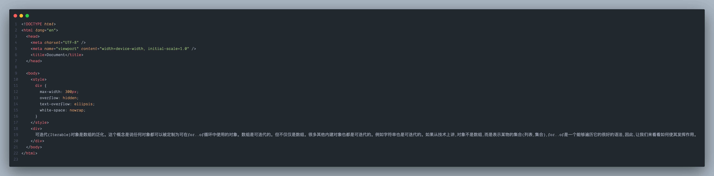
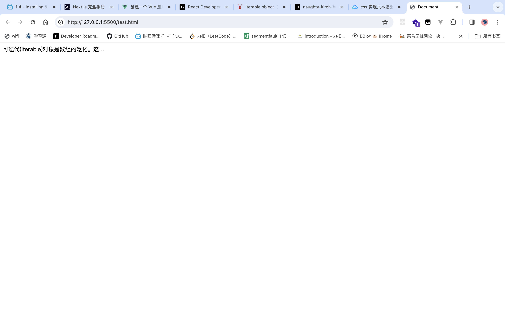
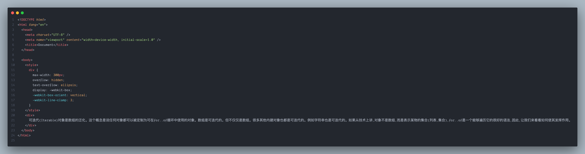

[TOC]


# 文本溢出显示省略号

1. 单行显示省略号

```css
// 溢出隐藏
overflow: hidden;
// 溢出的文本呈现为省略号
text-overflow:ellipsis;
// 禁止文本换行
white-space: nowrap;
```

效果:




2. 多行显示省略号

```css
// 溢出隐藏
overflow: hidden;
// 溢出的文本呈现为省略号
text-overflow: ellipsis;
// 必须结合的属性 ，将对象作为弹性伸缩盒子模型显示
display: -webkit-box;
// 必须结合的属性 ，设置或检索伸缩盒对象的子元素的排列方式
-webkit-box-orient: vertical;
// 是一个 不规范的属性 必须结合上面三个属性来使用
// 这里的值写成 几 , 那么就显示几行
-webkit-line-clamp: 3;
```

效果:




3. 还有可以使用 `js` 来控制(之前 `react` 中用到的一个例子)

```react
import { useState } from "react";
import styled from "styled-components";

const TextBox = ({ children, showWords = 10 }) => {
  const [maxWords, setMaxWords] = useState(showWords);
  const [showAll, setShowAll] = useState(false);

  const textTemple = children;

  const handleClick = () => {
    setShowAll(!showAll);
  };

  return (
    <Wrapper $maxWords={maxWords}>
      {showAll ? textTemple : `${children.substring(0, maxWords)}... `}
      <span
        onClick={handleClick}
        style={{ color: "purple", fontWeight: "bold", cursor: "pointer" }}
      >
        {showAll ? "查看更少" : "查看更多"}
      </span>
    </Wrapper>
  );
};

export default TextBox;

const Wrapper = styled.div``;

```


----


# 选择器

## 简单属性选择器


`[]`选择属性,比如:

```html
<h1 important> h1... </h1>
<h1> (2) h1... </h1>
```

```css
h1[important] {
  color: red;
}
```

只有第一个`h1`标签才会应用这个样式


## 根据具体属性值选择


## 根据部分属性值选择


## 选择子元素


## 选择相邻兄弟元素


# 伪类

## `:first-child :last-child :nth-child()`

```css
li:first-child {
  /* ... */
}
```

`:first-child` 选择父元素中下一个孩子，`last-child` 选择父元素中的最后一个孩子，`nth-child()` 括号中数字代指第几个孩子

`nth-child(odd)`选择所有的奇数子元素，`nth-child(even)`相反，选择所有偶数子元素

如果是这种情况：

```css
article p:last-child {
  /* ... */
}
```

这里意思就变成了在 `article` 这个父元素中，找到他的一个子元素 `p` ，并且这个元素是他的最后一个子元素

> ⚠️注意
>
> 


## `:link :visited :hover :active`

这几个伪类都是给超链接用的，除了`:hover` 在其他地方也经常使用

- `:link` 设置超链接的一般样式
- `:visited` 设置在超链接在访问过后显示的样子
- `:hover` 设置鼠标悬停在超链接上方时的样式
- `:active` 设置鼠标点击超链接时的样子

>  ⚠️注意，最好就是按照这几个顺序写样式-- "LVHA" 打乱顺序的话可能会出现莫名其妙的问题


## 根据语言选择

有些情况想根据元素的语言来选择，这个时候就可以使用 `:lang()` 伪类。

这个就像是属性选择器，例如把所有法语元素变成斜体：

```css
*:lang(fr) {
  font-style: italic;
}
```


## 结合伪类

可以在同一个选择器中结合使用伪类。


# 伪元素

> 伪元素能够在文档中插入假想的元素，从而得到某种效果。
>
> 伪类只有一个冒号,伪元素有两个冒号
>
> 任何伪元素都是内联的


## `::first-letter`

```css
h1::first-letter {
  font-style: normal;
  margin-right: 5px;
}
```

`h1::first-letter`选中 h1 元素中的第一个字符


## `::first-line`

选中第一行

> :old_key:补充
>
> ```html
> <div>
> <h3> Hello </h3>
> <p> World </p> <!-- 作用于这个 -->
> </div>
> ```
>
> 
>
> ```css
> h3 + p {
> /* ... */
> }
> ```
>
> 是兄弟选择器,选择在`h3`之后的`p`元素


## `::before  ::after`

==用的最多的伪元素==

```css
h2::after {
  content: "TOP";
  background-color: #ffe70e;
  color: #444;
  font-size: 16px;
  font-weight: bold;
  display: inline-block;
  padding: 5px 10px;
  position: absolute;
  top: -10px;
  right: -25px;
}
```

> 这段 CSS 代码是为 `h2` 元素的伪元素 `::after`（在 h2 元素内容之后插入的虚拟元素）添加样式的规则集合。下面是对每个属性的详细解释：
>
> 1. `content: "TOP";`
>    - 定义了伪元素的内容为字符串 "TOP"。这个属性是必需的，因为伪元素需要有内容才能显示。
>
> 2. `background-color: #ffe70e;`
>    - 设置伪元素的背景颜色为 #ffe70e（浅黄色）。
>
> 3. `color: #444;`
>    - 设置伪元素的文本颜色为 #444（深灰色）。
>
> 4. `font-size: 16px;`
>    - 指定伪元素的字体大小为 16 像素。
>
> 5. `font-weight: bold;`
>    - 设置伪元素的字体加粗。
>
> 6. `display: inline-block;`
>    - 将伪元素的显示属性设置为 `inline-block`，这使得它既具有行内元素的特性（与文本在同一行），又具有块级元素的特性（可以设置宽度、高度等）。
>
> 7. `padding: 5px 10px;`
>    - 设置伪元素的内边距，上下为 5 像素，左右为 10 像素。
>
> 8. `position: absolute;`
>    - 将伪元素的定位方式设置为绝对定位，相对于最近的已定位祖先元素。
>
> 9. `top: -10px;`
>    - 将伪元素相对于其包含块上边缘向上偏移 10 像素。负值表示向上偏移。
>
> 10. `right: -25px;`
>     - 将伪元素相对于其包含块右边缘向左偏移 25 像素。负值表示向左偏移。
>
> 总体而言，这段 CSS 代码的作用是在每个 `h2` 元素的内容后面添加一个带有特定样式的伪元素，形成一个视觉上的装饰元素，以突出显示 `h2` 元素的某些特征。

`::before`则与其相反,用于在元素最开始添加一个虚拟元素


## 插曲

在上面的第六点中,`display`的作用还能展开讲很多, chat-gpt 给出的解释:

> `display` 是 CSS 中一个非常重要的属性，用于指定 HTML 元素的显示方式。以下是一些常见的 `display` 属性值及其作用：
>
> 1. `display: block;`
>    - 将元素显示为块级元素，会在页面上独占一行，可以设置宽度、高度等。
>
> 2. `display: inline;`
>    - 将元素显示为行内元素，不会独占一行，只会占据内容所需的空间。
>
> 3. `display: inline-block;`
>    - 将元素显示为行内块级元素，具有行内元素的特点，同时可以设置宽度、高度等块级元素的属性。
>
> 4. `display: none;`
>    - 隐藏元素，元素不会在页面中占用空间，也不会影响文档流。
>
> 5. `display: flex;`
>    - 将元素变成一个弹性容器，可以通过子元素的属性控制弹性盒子的布局。
>
> 6. `display: grid;`
>    - 将元素变成一个网格容器，可以通过子元素的属性控制网格布局。
>
> 7. `display: inline-flex;`
>    - 将元素显示为行内弹性容器。
>
> 8. `display: inline-grid;`
>    - 将元素显示为行内网格容器。
>
> 9. `display: table;`
>    - 将元素显示为表格，通常与 `table-row`、`table-cell` 等配合使用。
>
> 10. `display: table-row;`
>     - 将元素显示为表格行。
>
> 11. `display: table-cell;`
>     - 将元素显示为表格单元格。
>
> 12. `display: inline-table;`
>     - 将元素显示为行内表格。
>
> 13. `display: list-item;`
>     - 将元素显示为列表项，通常用于 `<li>` 元素。
>
> 14. `display: run-in;`
>     - 根据上下文将元素显示为块级或行内元素。
>
> 这些 `display` 属性值使得开发者可以灵活地控制元素在页面中的布局和显示方式，适应不同的设计需求。
>
> ==另外==
>
> 在 HTML 中，元素可以分为三种主要类型：**块级元素**（Block-level Elements）、**行内元素**（Inline Elements）和**行内块级元素**（Inline-block Elements）。它们在页面上的表现和布局方式有一些区别。
>
> 1. **块级元素（Block-level Elements）:**
>    - **特点：**
>      - 占据一整行或多整行的空间，垂直方向上会自动换行。
>      - 可以设置宽度、高度、内外边距等属性。
>      - 常见的块级元素有 `<div>`、`<p>`、`<h1>` 到 `<h6>`、`<ul>`、`<ol>`、`<li>` 等。
>
> 2. **行内元素（Inline Elements）:**
>    - **特点：**
>      - 只占据其内容的空间，不会独占一行，水平方向上不会换行。
>      - 不可以设置宽度和高度。
>      - 常见的行内元素有 `<span>`、`<a>`、`<strong>`、`<em>`、``、`<br>` 等。
>
> 3. **行内块级元素（Inline-block Elements）:**
>    - **特点：**
>      - 既具有块级元素的特点（可以设置宽度、高度、内外边距等），又具有行内元素的特点（水平方向上不会换行）。
>      - 在同一行内排列，但不会占据整行。
>      - 常见的行内块级元素有 `<span>`（设置 `display: inline-block;`）、``（默认是行内元素，可以通过样式设置为 `display: inline-block;`）等。
>
> **总结：**
>
> - **块级元素**通常用于页面布局的结构，它们独占一行或多行，可以包含其他块级元素和行内元素。
> - **行内元素**主要用于内联文本标记，它们只占据内容所需的空间，不会强制换行。
> - **行内块级元素**在一些布局场景中提供了块级元素和行内元素的结合，适用于水平排列的情况，但又需要设置宽度、高度等属性。

后面关于 display 的细节还会一一道来


# 结构和层叠

## 优先级


## 继承


有一个文档树结构：


将声明 `color:gray` 应用到 `ul`元素时，这个元素就会采用这个声明，并且该值会再沿着树向下传播到后代元素，并且一直继续，直到再没有更多的后代元素继承这个值为止。

值绝对不会向上传递，也就是说，元素不会把值向上传递到其祖先。

> 注意：在HTML 中，对于向上传播规则有一个例外：应用到body元素的背景样式可以传递到 html 元素（html 是文档的根元素），相应地可以定义其画布。


# Box model


> :information_desk_person:`width:100%`中 100% 是相对于父元素的大小而定的。
>
> 子元素永远不可能比父元素宽

根据盒模型，就有一个简单的使元素居中的方法

```html
<div class='container'>
  <p> ... </p>
  <a> ... </a>
  <h1> ... </h1>
   <!-- //other element -->
</div>
```

```css
.container {
  width: 800px;
  margin: 0 auto;
}
```

在上面的 container 中包含一些子元素，这些元素都在 `div` 里居中

`margin: 0 auto` 指 div 上下的边距为 0，左右边距为 auto，意思是让浏览器自动计算左右的边距，因此浏览器会让左右的边距都相等，因此可以达到元素居中的效果

:eyes: 但有个问题，用这种方法居中要设置一个宽度，如果浏览器窗口小于这个宽度的时候这种居中的效果就没有了


# Position

用的较多的有`absolute`和`relative`两种定位,其他的还有`fixed`等等.

使用`absolute`定位的话,该元素就脱离了浏览器对他的束缚,其他的约束都不再对他产生影响,他会向上找到一个定位是`relative`的父元素作为参考.如果都没找到的话,就用`body`作为参考


:warning:绝对定位不要滥用


# 布局

## 概述


## float

```css
.author-img {
  float: left;
  margin-bottom: 20px;
}

.author {
  margin-top: 10px;
  float: left;
  margin-left: 20px;
}
```

其中`float` 是 CSS 中的一个属性，它主要用于控制元素在其**父容器**中的水平浮动，将元素移动到容器的左侧或右侧。虽然 `float` 在过去用于实现页面布局，但现在更多的是通过其他布局技术，比如 Flexbox 和 Grid 来实现。尽管如此，了解 `float` 仍然有助于理解一些旧有的代码。

`float` 的主要作用包括：

1. **浮动元素：** 使用 `float` 属性可以使元素浮动到父元素的左侧或右侧。浮动的元素不再在正常的文档流中，而是==脱离文档流==，使得其他元素能够环绕浮动元素。

   ```css
   .example {
     float: left; /* 或 right */
   }
   ```

2. **创建多列布局：** 在早期的网页设计中，`float` 被用于创建多列布局，通过浮动左侧和右侧的列来实现。现在，更推荐使用 CSS Grid 或 Flexbox 来实现类似的效果。

   ```css
   .column {
     float: left;
     width: 50%;
   }
   ```

3. **清除浮动：** 当一个元素浮动时，它可能会影响其后续元素的布局，使得它们覆盖在浮动元素之上。为了解决这个问题，可以使用清除浮动的技巧，例如添加 `clear: both;` 的样式规则，确保后续元素不被浮动元素覆盖。

   ```css
   .clearfix::after {
     content: "";
     display: table;
     clear: both;
   }
   ```

需要注意的是，使用 `float` 会使元素脱离正常文档流，可能引起一些布局问题。因此，现代布局更倾向于使用 Flexbox 或 Grid，这些布局技术更直观、灵活且易于维护。

> :information_desk_person:在现代 CSS 开发中，建议优先使用 Flexbox 和 Grid 布局，而尽量避免使用 `float` 布局。这是因为 Flexbox 和 Grid 提供了更灵活、更强大的布局能力，使得页面设计更加简单、直观、易于维护。以下是一些原因：
>
> 1. **Flexbox（弹性盒模型）：**
>    - 适用于单维度布局，特别是在处理一系列子元素时非常强大。
>    - 可以轻松实现水平和垂直居中，以及对齐等操作。
>    - 简化了元素在主轴和交叉轴上的对齐和分布。
>    - 更容易实现响应式布局。
>
>    ```css
>    .container {
>      display: flex;
>      justify-content: space-between;
>    }
>    ```
>
> 2. **Grid（网格布局）：**
>    - 适用于二维布局，可以更方便地处理行和列。
>    - 允许将页面划分为网格区域，使得设计更具有结构。
>    - 简化了元素在网格中的排列和定位。
>    - 提供了强大的自动布局功能，适用于复杂的布局需求。
>
>    ```css
>    .container {
>      display: grid;
>      grid-template-columns: repeat(3, 1fr);
>      grid-gap: 10px;
>    }
>    ```
>
> 3. **`float` 布局的弊端：**
>    - `float` 主要用于文字环绕效果和旧有的布局方式，容易导致父元素高度塌陷问题。
>    - 不够直观，容易造成清除浮动等额外的处理工作。
>    - 不利于响应式设计，需要额外的媒体查询或其他手段来实现。
>
> 当然，根据具体的布局需求，有时候也可能需要混合使用这些布局方式。但总体而言，Flexbox 和 Grid 提供了更现代、更灵活的解决方案，能够更好地满足复杂的布局需求。
>
> **什么场合下适合使用 float?**
>
> 尽管在现代 CSS 中推荐使用 Flexbox 和 Grid 进行布局，但在一些特定的场合，仍然可以使用 `float`。以下是一些适合使用 `float` 的场景：
>
> 1. **文字环绕效果：** `float` 最初设计用于实现文字环绕图片的效果。如果你需要在文本周围放置图片或其他元素，使用 `float` 可能会是一个合适的选择。
>
>    ```css
>    img {
>      float: left;
>      margin-right: 10px;
>    }
>    ```
>
> 2. **旧有的布局代码：** 在一些维护老旧代码的情况下，可能会遇到使用 `float` 进行布局的情况。虽然现代项目更推荐使用 Flexbox 和 Grid，但在修改现有代码时，可能需要继续使用 `float` 以保持一致性。
>
> 3. **浏览器兼容性：** 在处理老旧浏览器的兼容性时，有时候 `float` 可能是一个更安全的选择。尽管 Flexbox 和 Grid 已经得到广泛支持，但在一些特殊情况下，可能需要使用 `float` 以确保在较旧的浏览器中正常显示。
>
> 请注意，尽管 `float` 可能在上述情况下适用，但在一般的页面布局和设计中，最好使用 Flexbox 或 Grid，因为它们提供更直观、灵活且强大的布局能力，能更好地适应现代的设计需求。


## Box-Sizing

 

```css
* {
  box-sizing: border-box;
}
```

`box-sizing: border-box;` 是一个 CSS 属性，用于指定盒模型的尺寸计算方式。在默认的 `content-box` 模型下，一个元素的宽度和高度只包括内容区域，而 `border-box` 则包括了内边距（padding）和边框（border）的宽度。

具体来说，`box-sizing: border-box;` 的作用是：

1. **包含内边距和边框在内：** 元素的宽度和高度的计算会包括内边距和边框的宽度，而不仅仅是内容区域。这样可以更方便地设置元素的尺寸，特别是在进行响应式设计时。

2. **更直观的尺寸设定：** 当使用 `border-box` 模型时，指定元素的宽度和高度即可包含所有内容、内边距和边框，而不需要考虑这些部分的宽度会额外撑开元素。

3. **避免盒模型计算问题：** 在默认的 `content-box` 模型下，调整元素的内边距和边框大小会导致元素的实际宽度和高度变化，可能会引起布局问题。使用 `border-box` 可以更好地控制元素的尺寸。

使用示例：

```css
/* 将所有元素的盒模型设置为 border-box */
* {
  box-sizing: border-box;
}

/* 单独设置某个元素的盒模型为 border-box */
.example {
  box-sizing: border-box;
}
```

在现代 web 开发中，很多项目会将所有元素的 `box-sizing` 设置为 `border-box`，以简化布局的计算和调整。这使得通过设置宽度和高度来精确控制元素的尺寸更加直观和容易。


## FlexBox

```css
.container {
  display: flex;
  align-items: center;
  justify-content: space-between;
}
```


> 中间那个 css 标签那么高是因为给他设置了高度的

1. **`display: flex;`：**
   - 此规则将 `.container` 元素指定为 Flex 容器，使其内部的直接子元素成为 Flex 项目。

2. **`align-items: center;`：**
   - 此规则将 Flex 项目在交叉轴上（垂直轴，因为默认 `flex-direction` 为 `row`）居中对齐。也就是说，Flex 项目将在垂直方向上相对于容器居中。

3. **`justify-content: space-between;`：**
   - 此规则将 Flex 项目在主轴上（水平轴，因为默认 `flex-direction` 为 `row`）分散对齐。容器内的空间将在 Flex 项目之间均匀分布，使得第一个项目位于容器的起始端，最后一个项目位于容器的末尾端。

综合起来，这段 CSS 代码创建了一个 Flex 容器 `.container`，其中包含的 Flex 项目在垂直方向上居中对齐，水平方向上则均匀分布在容器两侧。这种布局经常用于创建水平导航栏、页眉、页脚等。

> ==**align-items 和 align-content 的区别**==
>
> `align-items` 和 `align-content` 是 Flexbox 布局中用于控制交叉轴上对齐方式的两个属性，它们有一些区别：
>
> 1. **`align-items`：**
>    - 用于设置 Flex 容器内的所有 Flex 项目在交叉轴上的对齐方式。
>    - 具体来说，它影响 Flex 容器内的每个行（在默认的 `flex-direction: row` 情况下）或每列（在 `flex-direction: column` 情况下）中的 Flex 项目的对齐方式。
>    - 值可以是 `flex-start`、`flex-end`、`center`、`baseline` 或 `stretch`。
>
>      ```css
>      .flex-container {
>        align-items: center; /* 或其他值，如flex-start、flex-end、baseline、stretch */
>      }
>      ```
>
> 2. **`align-content`：**
>    - 用于设置多行（或多列）的 Flex 项目在交叉轴上的对齐方式。
>    - 当 Flex 容器有多行（`flex-wrap: wrap`）或多列时，`align-content` 控制这些行或列之间的对齐方式。
>    - 值可以是 `flex-start`、`flex-end`、`center`、`space-between`、`space-around` 或 `stretch`。
>
>      ```css
>      .flex-container {
>        align-content: space-between; /* 或其他值，如flex-start、flex-end、center、space-around、stretch */
>      }
>      ```
>
> 综述来说，`align-items` 控制 Flex 容器内单个行或列的对齐方式，而 `align-content` 控制多行（或多列）之间的对齐方式。在大多数情况下，`align-items` 更常用，因为它可以在单个行或列上定位 Flex 项目，而 `align-content` 更适合在容器有多行或多列时对它们进行整体调整。


> ==**justify-content 和 justify-items 的区别**==
>
> 在 Flexbox 布局中，`justify-content` 和 `justify-items` 是用于控制主轴上对齐方式的两个属性，但它们分别应用于不同的层级。
>
> 1. **`justify-content`：**
>    
>    - 用于设置 Flex 容器内的所有 Flex 项目在主轴上的对齐方式。
>    - 具体来说，它影响 Flex 容器内的每行（在默认的 `flex-direction: row` 情况下）或每列（在 `flex-direction: column` 情况下）中的 Flex 项目的对齐方式。
>    - 值可以是 `flex-start`、`flex-end`、`center`、`space-between`、`space-around` 或 `space-evenly`。
>    
>      ```css
>      .flex-container {
>        justify-content: space-between; /* 或其他值，如flex-start、flex-end、center、space-around、space-evenly */
>      }
>      ```
>    
> 2. **`justify-items`：**
>    - 与 `justify-content` 不同，`justify-items` 是应用于 Flex 容器内的所有 Flex 项目的属性。
>    - 它设置每个 Flex 项目在主轴上的对齐方式，覆盖了单个项目上的 `justify-self` 属性（如果有的话）。
>    - 值可以是 `start`、`end`、`center`、`stretch`。
>
>      ```css
>      .flex-container {
>        justify-items: center; /* 或其他值，如start、end、stretch */
>      }
>      ```
>
> 综述来说，`justify-content` 控制 Flex 容器内单个行或列的对齐方式，而 `justify-items` 控制 Flex 容器内所有项目的对齐方式。通常情况下，`justify-content` 更为常用，因为它可以在单个行或列上定位 Flex 项目，而 `justify-items` 更适合在容器内对所有项目进行整体调整。请注意，`justify-items` 在 CSS Grid 布局中也有类似的作用，但在 Flexbox 中的应用相对较少。


```css
.el--1 {
  align-self: flex-start;
}
```


`align-self` 是 Flexbox 布局中用于设置单个 Flex 项目在交叉轴上对齐方式的属性。具体来说，它覆盖了容器上的 `align-items` 属性，允许你为特定的 Flex 项目定义独立的交叉轴对齐方式。

在上述代码中，`.el--1` 类的 Flex 项目将在交叉轴上使用 `flex-start` 进行对齐。这意味着该项目将位于容器交叉轴的起始端。

具体的 `align-self` 可选值包括：

- **`auto`：** 使用父容器的 `align-items` 属性值。
- **`flex-start`：** 在交叉轴的起始端对齐。
- **`flex-end`：** 在交叉轴的末尾端对齐。
- **`center`：** 在交叉轴的中心对齐。
- **`baseline`：** 在基线上对齐。
- **`stretch`：** 沿交叉轴拉伸以适应容器。

这个属性对于需要个别调整 Flex 项目在交叉轴上的位置而不影响其他项目的情况非常有用。


```css
.el--6{
  order: -1;
}
```

`order` 属性用于指定 Flex 项目在 Flex 容器内的排列顺序。

在这里，`order: -1;` 的负值意味着 `.el--6` 会被放置在默认排序之前。默认情况下，Flex 项目的 `order` 值为 `0`，表示它们按照它们在源代码中出现的顺序排列。通过为特定项目设置不同的 `order` 值，你可以改变它们的排列顺序。

如果其他 Flex 项目的 `order` 值为默认值（`0`），那么`.el--6` 将被移动到 Flex 容器中的开头，即在排列上会出现在那些 `order` 值为非负数的项目之前。

请注意，`order` 的实际值并不重要，而是相对于其他项目的值。比如，如果 `.el--6` 的 `order` 为 `-1`，而其他项目的 `order` 为 `1` 和 `2`，那么`.el--6` 仍然会在它们之前排列，因为 `-1` 小于 `1` 和 `2`。


```css
.el {
  /* DEFAULTS: */
  flex-grow: 0;
  flex-shrink: 1;
  flex-basis: auto;
}
```

1. **`flex-grow: 0;`：**
   - `flex-grow` 定义了 Flex 项目在主轴上的扩展能力。当容器的剩余空间大于项目所需的空间时，项目将根据 `flex-grow` 的值进行分配。在这里，`flex-grow: 0` 表示 `.el` 这个项目不会扩展，即不会占用多余的空间。
   - **值 大于 `0`：** 表示项目可以在剩余空间中扩展。具体值确定了扩展的相对比例。如果有多个具有不同 `flex-grow` 值的项目，它们将根据这个比例分配额外的空间。
2. **`flex-shrink: 1;`：**
   - `flex-shrink` 定义了 Flex 项目在主轴上的收缩能力。当容器的空间不足以容纳所有项目时，项目将根据 `flex-shrink` 的值进行收缩。在这里，`flex-shrink: 1` 表示 `.el` 这个项目会按照默认比例进行收缩，以适应容器的可用空间。
   - **值 小于 `1`：** 表示项目收缩的速度相对较慢。值越小，收缩的幅度越小。
   - **`flex-shrink: 0;`：** 项目不会收缩。即使容器的空间不足以容纳所有项目，拥有 `flex-shrink: 0;` 的项目也不会按照默认比例收缩。它将保持其初始大小，不会减小。
3. **`flex-basis: auto;`：**
   - `flex-basis` 定义了 Flex 项目在主轴上的初始大小。`auto` 表示 `.el` 的初始大小由其内容和/或固定尺寸决定。如果你设置了一个具体的长度值（如 `flex-basis: 200px;`），那么项目将以这个值作为初始大小。
   - **值 具体的长度值（如 `flex-basis: 200px;`）：** 表示项目的初始大小将被设置为指定的长度值。无论容器的大小如何，项目都会始终具有这个初始大小。

综合起来，这组默认值的含义是：

- `.el` 这个项目不会主动扩展（`flex-grow: 0`）。
- 如果容器的空间不足，`.el` 会按照默认比例进行收缩（`flex-shrink: 1`）。
- `.el` 的初始大小由其内容和/或固定尺寸决定（`flex-basis: auto`）。


## Grid

```css
.container {
  display: grid;
	grid-template-columns: repeat(4, 1fr);
	grid-template-rows: 1fr 1fr;
}
```

`display: grid` 声明使用 grid 布局。`grid-template-columns: repeat(4, 1fr);`设置列数，后面那个`repeat(4, 1fr)`重复 4 列，每一列自动调整宽度（每一列等宽）。与`1fr 1fr 1fr 1fr`一个意思。


```css
.container {
  column-gap: 20px;
	row-gap: 20px;
}
```

设置间距


`column-gap` 设置列与列之间的，后面那个设置行与行之间的


```css
.el--1 {
	grid-row: 1 / 3;
	grid-column: 1 / 3;
}
```

这个属性是用在表格布局的每一个子元素中的

`grid-row: 1 / 3` 的意思：让这个元素处于第一行，并且跨越到第三个间隔（也就是跨越 2 个格子）`grid-column`同理。就会像这样：


还有

- `grid-row: 1 / span 2`指的是让他处于第一行，并且跨越两个格子
- `grid-row: 1 / -1`。这种后面是负数的话，就代表让他跨越到做这一行的最后一个格子，这通常用于不知道具体列数的情况下。

想要对齐每个格子中的元素就可以使用`align-self`以及`justify-self`属性
