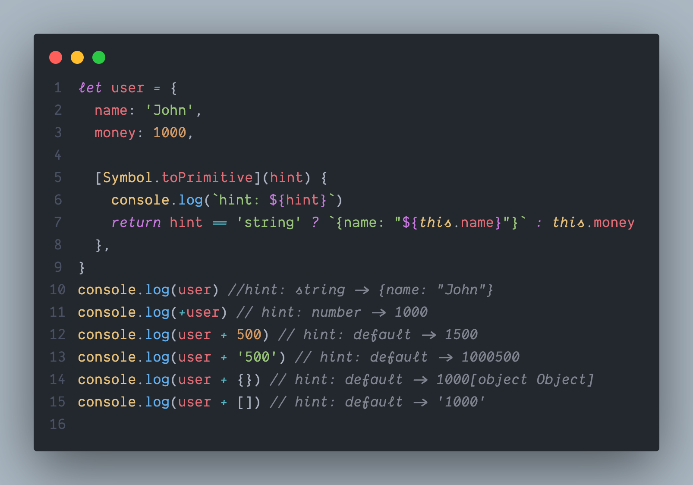
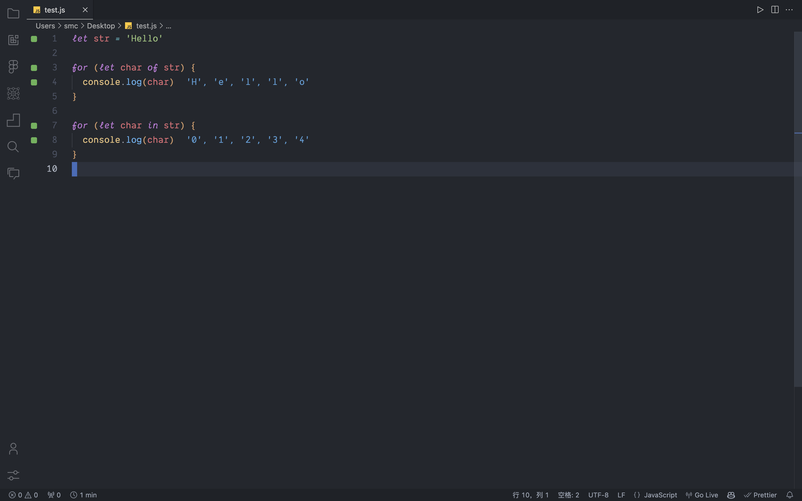
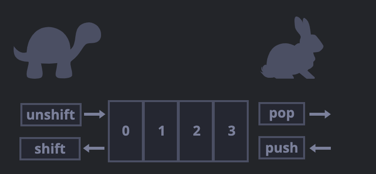
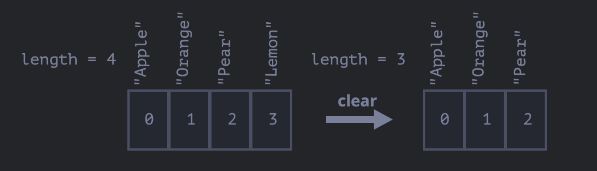
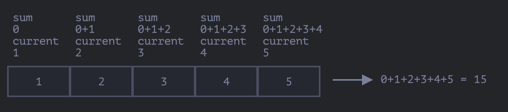

[TOC]


# 数据类型

## `BigInt`类型

在 JavaScript 中，“number” 类型无法安全地表示大于 `(253-1)`（即 `9007199254740991`），或小于 `-(253-1)` 的整数。也就是说，所有大于 `(253-1)` 的奇数都不能用 “number” 类型存储。

在大多数情况下，`±(253-1)` 范围就足够了，但有时候我们需要整个范围非常大的整数，例如用于密码学或微秒精度的时间戳。

`BigInt` 类型是最近被添加到 JavaScript 语言中的，用于表示任意长度的整数。

可以通过将 `n` 附加到整数字段的末尾来创建 `BigInt` 值。

```js
// 尾部的 "n" 表示这是一个 BigInt 类型
const bigInt = 1234567890123456789012345678901234567890n;
```

*大数运算只能是两个大数之间的运算,一个大数与另一个非大数运算的话就会报错*

```js
const bigInt = 1234567890123456789012345678901234567890n
console.log(bigInt + 2)
```


```js
const bigInt = 1234567890123456789012345678901234567890n
console.log(bigInt + 2n)
```


## `undefined`与`null`的区别

`null`不属于任何一种类型,它构成了一个独立的类型，只包含 `null` 值.相比较于其他编程语言，JavaScript 中的 `null` 不是一个“对不存在的 `object` 的引用”或者 “null 指针”.JavaScript 中的 `null` 仅仅是一个代表“无”、“空”或“值未知”的特殊值。

特殊值 `undefined` 和 `null` 一样自成类型。`undefined` 的含义是**未被赋值**。如果一个变量已被声明，但未被赋值，那么它的值就是 `undefined`

```js
let age = null

let age2

console.log(age, age2)
```


通常，使用 `null` 将一个“空”或者“未知”的值写入变量中，而 `undefined` 则保留作为未进行初始化的事物的默认初始值。


## `typeof`运算符

`typeof` 运算符返回参数的类型。当我们想要分别处理不同类型值的时候，或者想快速进行数据类型检验时，非常有用。

```js
typeof undefined // "undefined"

typeof 0 // "number"

typeof 10n // "bigint"

typeof true // "boolean"

typeof "foo" // "string"

typeof Symbol("id") // "symbol"

typeof Math // "object"  (1)

typeof null // "object"  (2)

typeof alert // "function"  (3)
```

> 最后三行可能需要额外的说明：
>
> 1. `Math` 是一个提供数学运算的内建 `object`。我们会在 [数字类型](https://zh.javascript.info/number) 一节中学习它。此处仅作为一个 `object` 的示例。
> 2. `typeof null` 的结果为 `"object"`。这是官方承认的 `typeof` 的错误，这个问题来自于 JavaScript 语言的早期阶段，并为了兼容性而保留了下来。`null` 绝对不是一个 `object`。`null` 有自己的类型，它是一个特殊值。`typeof` 的行为在这里是错误的。
> 3. `typeof alert` 的结果是 `"function"`，因为 `alert` 在 JavaScript 语言中是一个函数。我们会在下一章学习函数，那时我们会了解到，在 JavaScript 语言中没有一个特别的 “function” 类型。函数隶属于 `object` 类型。但是 `typeof` 会对函数区分对待，并返回 `"function"`。这也是来自于 JavaScript 语言早期的问题。从技术上讲，这种行为是不正确的，但在实际编程中却非常方便。


## 总结

JavaScript 中有八种基本的数据类型（译注：前七种为基本数据类型，也称为原始数据类型，而 `object` 为复杂数据类型）。

- 七种原始数据类型：
  - `number` 用于任何类型的数字：整数或浮点数，在 `±(253-1)` 范围内的整数。
  - `bigint` 用于任意长度的整数。
  - `string` 用于字符串：一个字符串可以包含 0 个或多个字符，所以没有单独的单字符类型。
  - `boolean` 用于 `true` 和 `false`。
  - `null` 用于未知的值 —— 只有一个 `null` 值的独立类型。
  - `undefined` 用于未定义的值 —— 只有一个 `undefined` 值的独立类型。
  - `symbol` 用于唯一的标识符。
- 以及一种非原始数据类型：
  - `object` 用于更复杂的数据结构。

我们可以通过 `typeof` 运算符查看存储在变量中的数据类型。

- 通常用作 `typeof x`，但 `typeof(x)` 也可行。
- 以==字符串==的形式返回类型名称，例如 `"string"`。
- `typeof null` 会返回 `"object"` —— 这是 JavaScript 编程语言的一个错误，实际上它并不是一个 `object`。


# 类型转换

字符串中,有些是隐性转换,比如说`alert(value)` 将 `value` 转换为字符串类型，然后显示这个值。还有显式转换,调用 `String(value)` 来将 `value` 转换为字符串类型：

数字转换与字符串类似,也可以使用 `Number(value)` 显式地将这个 `value` 转换为 number 类型。

```js
let value = true;
alert(typeof value); // boolean

value = String(value); // 现在，值是一个字符串形式的 "true"
alert(typeof value); // string


let str = "123";
alert(typeof str); // string

let num = Number(str); // 变成 number 类型 123

alert(typeof num); // number
```

**`null` 和 `undefined` 在这有点不同：`null` 变成数字 `0`，`undefined` 变成 `NaN`。**


## 总结

有三种常用的类型转换：转换为 string 类型、转换为 number 类型和转换为 boolean 类型。

**字符串转换** —— 转换发生在输出内容的时候，也可以通过 `String(value)` 进行显式转换。原始类型值的 string 类型转换通常是很明显的。

**数字型转换** —— 转换发生在进行算术操作时，也可以通过 `Number(value)` 进行显式转换。

数字型转换遵循以下规则：

| 值             | 变成……                                                       |
| :------------- | :----------------------------------------------------------- |
| `undefined`    | `NaN`                                                        |
| `null`         | `0`                                                          |
| `true / false` | `1 / 0`                                                      |
| `string`       | “按原样读取”字符串，两端的空白字符（空格、换行符 `\n`、制表符 `\t` 等）会被忽略。空字符串变成 `0`。转换出错则输出 `NaN`。 |

**布尔型转换** —— 转换发生在进行逻辑操作时，也可以通过 `Boolean(value)` 进行显式转换。

布尔型转换遵循以下规则：

| 值                                    | 变成……  |
| :------------------------------------ | :------ |
| `0`, `null`, `undefined`, `NaN`, `""` | `false` |
| 其他值                                | `true`  |

上述的大多数规则都容易理解和记忆。人们通常会犯错误的值得注意的例子有以下几个：

- 对 `undefined` 进行数字型转换时，输出结果为 `NaN`，而非 `0`。
- 对 `"0"` 和只有空格的字符串（比如：`" "`）进行布尔型转换时，输出结果为 `true`。


# 值的比较

## 对`null`和`undefind`的比较:

当使用 `null` 或 `undefined` 与其他值进行比较时，其返回结果常常出乎你的意料。

- 当使用严格相等 `===` 比较二者时

  它们不相等，因为它们属于不同的类型。

  ```js
  alert( null === undefined ); // false
  ```

- 当使用非严格相等 `==` 比较二者时

  JavaScript 存在一个特殊的规则，会判定它们相等。它们俩就像“一对恋人”，仅仅等于对方而不等于其他任何的值（只在非严格相等下成立）。

  ```js
  alert( null == undefined ); // true
  ```

- 当使用数学式或其他比较方法 `< > <= >=` 时：

  `null/undefined` 会被转化为数字：`null` 被转化为 `0`，`undefined` 被转化为 `NaN`。


## `null`与`0`的比较

```js
alert( null > 0 );  // (1) false
alert( null == 0 ); // (2) false
alert( null >= 0 ); // (3) true
```

为什么会出现这种反常结果，这是因为相等性检查 `==` 和普通比较符 `> < >= <=` 的代码逻辑是相互独立的。进行值的比较时，`null` 会被转化为数字，因此它被转化为了 `0`。这就是为什么（3）中 `null >= 0` 返回值是 true，（1）中 `null > 0` 返回值是 false。

另一方面，`undefined` 和 `null` 在相等性检查 `==` 中不会进行任何的类型转换，它们有自己独立的比较规则，所以除了它们之间互等外，不会等于任何其他的值。这就解释了为什么（2）中 `null == 0` 会返回 false。


## 特立独行的`undefind`

`undefined` 不应该被与其他值进行比较：

```js
alert( undefined > 0 ); // false (1)
alert( undefined < 0 ); // false (2)
alert( undefined == 0 ); // false (3)
```

- `(1)` 和 `(2)` 都返回 `false` 是因为 `undefined` 在比较中被转换为了 `NaN`，而 `NaN` 是一个特殊的数值型值，它与任何值进行比较都会返回 `false`。
- `(3)` 返回 `false` 是因为这是一个相等性检查，而 `undefined` 只与 `null` 相等，不会与其他值相等。

>  因此,在值的比较中,`> < >= <=`与`== ===`这两类是不同的,普通比较符会进行转换,而相等性检查不会
>
> ```js
> console.log('1' == 1) // true
> console.log('1' === 1) // false
> console.log(NaN == NaN) // false
> console.log(NaN === NaN) // false
> console.log(undefined == null) // true
> console.log(undefined === null) // false
> ```

## 总结

- 比较运算符始终返回布尔值。
- 字符串的比较，会按照“词典”顺序逐字符地比较大小。
- 当对不同类型的值进行比较时，它们会先被转化为数字（不包括严格相等检查）再进行比较。
- 在非严格相等 `==` 下，`null` 和 `undefined` 相等且各自不等于任何其他的值。
- 在使用 `>` 或 `<` 进行比较时，需要注意变量可能为 `null/undefined` 的情况。比较好的方法是单独检查变量是否等于 `null/undefined`。


# 空值合并运算符 '??'

> **最近新增的特性**
>
> 这是一个最近添加到 JavaScript 的特性。 旧式浏览器可能需要 polyfills.

空值合并运算符（nullish coalescing operator）的写法为两个问号 `??`。

`a ?? b` 的结果是：

- 如果 `a` 是已定义的，则结果为 `a`，
- 如果 `a` 不是已定义的，则结果为 `b`。

换句话说，如果第一个参数不是 `null/undefined`，则 `??` 返回第一个参数。否则，返回第二个参数。

空值合并运算符并不是什么全新的东西。它只是一种获得两者中的第一个“已定义的”值的不错的语法。

我们可以使用我们已知的运算符重写 `result = a ?? b`，像这样：

```js
result = (a !== null && a !== undefined) ? a : b;
```


## 优先级

`??` 运算符的优先级与 `||` 相同，它们的的优先级都为 `4`，详见：[MDN](https://developer.mozilla.org/en-US/docs/Web/JavaScript/Reference/Operators/Operator_Precedence#Table)。

这意味着，就像 `||` 一样，空值合并运算符在 `=` 和 `?` 运算前计算，但在大多数其他运算（例如 `+` 和 `*`）之后计算。

所以我们可能需要在这样的表达式中添加括号：

```javascript
let height = null;
let width = null;

// 重要：使用括号
let area = (height ?? 100) * (width ?? 50);

alert(area); // 5000
```

出于安全原因，JavaScript 禁止将 `??` 运算符与 `&&` 和 `||` 运算符一起使用，除非使用括号明确指定了优先级。


## 总结

- 空值合并运算符 `??` 提供了一种从列表中选择第一个“已定义的”值的简便方式。

  它被用于为变量分配默认值：

  ```javascript
  // 当 height 的值为 null 或 undefined 时，将 height 的值设置为 100
  height = height ?? 100;
  ```

- `??` 运算符的优先级非常低，仅略高于 `?` 和 `=`，因此在表达式中使用它时请考虑添加括号。

- 如果没有明确添加括号，不能将其与 `||` 或 `&&` 一起使用。


# 函数

## 空值的 `return` 或没有 `return` 的函数返回值为 `undefined`

如果函数无返回值，它就会像返回 `undefined` 一样：

```javascript
function doNothing() { /* 没有代码 */ }

console.log( doNothing() === undefined ); // true
```

空值的 `return` 和 `return undefined` 等效：

```javascript
function doNothing() {
  return;
}

console.log( doNothing() === undefined ); // true
```


## 不要在 `return` 与返回值之间添加新行

对于 `return` 的长表达式，可能你会很想将其放在单独一行，如下所示：

```javascript
return
 (some + long + expression + or + whatever * f(a) + f(b))
```

但这不行，因为 JavaScript 默认会在 `return` 之后加上分号。上面这段代码和下面这段代码运行流程相同：

```javascript
return;
 (some + long + expression + or + whatever * f(a) + f(b))
```

因此，实际上它的返回值变成了空值。

如果我们想要将返回的表达式写成跨多行的形式，那么应该在 `return` 的同一行开始写此表达式。或者至少按照如下的方式放上左括号：

```javascript
return (
  some + long + expression
  + or +
  whatever * f(a) + f(b)
  )
```

然后它就能像我们预想的那样正常运行了。


## 总结

函数声明方式如下所示：

```javascript
function name(parameters, delimited, by, comma) {
  /* code */
}
```

- 作为参数传递给函数的值，会被复制到函数的局部变量。
- 函数可以访问外部变量。但它只能从内到外起作用。函数外部的代码看不到函数内的局部变量。
- 函数可以返回值。如果没有返回值，则其返回的结果是 `undefined`。

为了使代码简洁易懂，建议在函数中主要使用局部变量和参数，而不是外部变量。

与不获取参数但将修改外部变量作为副作用的函数相比，获取参数、使用参数并返回结果的函数更容易理解。

函数命名：

- 函数名应该清楚地描述函数的功能。当我们在代码中看到一个函数调用时，一个好的函数名能够让我们马上知道这个函数的功能是什么，会返回什么。
- 一个函数是一个行为，所以函数名通常是动词。
- 目前有许多优秀的函数名前缀，如 `create…`、`show…`、`get…`、`check…` 等等。使用它们来提示函数的作用。

函数是脚本的主要构建块。现在我们已经介绍了基本知识，现在我们就可以开始创建和使用函数了。但这只是学习和使用函数的开始。我们将继续学习更多函数的相关知识，更深入地研究它们的先进特征


# 对象基础

## 移除属性

可以用 `delete` 操作符移除属性：

```js
delete user.age
```


## 属性值简写

属性名跟变量名一样。这种通过变量生成属性的应用场景很常见，在这有一种特殊的 **属性值缩写** 方法，使属性名变得更短。

可以用 `name` 来代替 `name:name` 像下面那样：

```js
function makeUser(name, age) {
  return {
    name, // 与 name: name 相同
    age,  // 与 age: age 相同
    // ...
  };
}
```


## 属性存在性测试，`in`操作符

相比于其他语言，JavaScript 的对象有一个需要注意的特性：能够被访问任何属性。即使属性不存在也不会报错！

读取不存在的属性只会得到 `undefined`。所以我们可以很容易地判断一个属性是否存在：

```javascript
let user = {};

alert( user.noSuchProperty === undefined ); // true 意思是没有这个属性
```

这里还有一个特别的，检查属性是否存在的操作符 `"in"`。

语法是：

```javascript
"key" in object
```

例如：

```javascript
let user = { name: "John", age: 30 };

alert( "age" in user ); // true，user.age 存在
alert( "blabla" in user ); // false，user.blabla 不存在。
```

请注意，`in` 的左边必须是 **属性名**。通常是一个带引号的字符串。

如果我们省略引号，就意味着左边是一个变量，它应该包含要判断的实际属性名。例如：

```javascript
let user = { age: 30 };

let key = "age";
alert( key in user ); // true，属性 "age" 存在
```

为何会有 `in` 运算符呢？与 `undefined` 进行比较来判断还不够吗？

确实，大部分情况下与 `undefined` 进行比较来判断就可以了。但有一个例外情况，这种比对方式会有问题，但 `in` 运算符的判断结果仍是对的。

那就是属性存在，但存储的值是 `undefined` 的时候：

```javascript
let obj = {
  test: undefined
};

alert( obj.test ); // 显示 undefined，所以属性不存在？

alert( "test" in obj ); // true，属性存在！
```


## `for in`循环

为了遍历一个对象的所有键（key），可以使用一个特殊形式的循环：`for..in`。这跟我们在前面学到的 `for(;;)` 循环是完全不一样的东西。

语法：

```javascript
for (key in object) {
  // 对此对象属性中的每个键执行的代码
}
```

例如，让我们列出 `user` 所有的属性：

```javascript
let user = {
  name: "John",
  age: 30,
  isAdmin: true
};

for (let key in user) {
  // keys
  alert( key );  // name, age, isAdmin
  // 属性键的值
  alert( user[key] ); // John, 30, true
}
```

注意，所有的 “for” 结构体都允许我们在循环中定义变量，像这里的 `let key`。

同样，我们可以用其他属性名来替代 `key`。例如 `"for(let prop in obj)"` 也很常用。


## 像对象一样排序

对象有顺序吗？换句话说，如果我们遍历一个对象，我们获取属性的顺序是和属性添加时的顺序相同吗？这靠谱吗？

简短的回答是：“有特别的顺序”：整数属性会被进行排序，其他属性则按照创建的顺序显示。详情如下：

例如，让我们考虑一个带有电话号码的对象：

```javascript
let codes = {
  "49": "Germany",
  "41": "Switzerland",
  "44": "Great Britain",
  // ..,
  "1": "USA"
};

for(let code in codes) {
  alert(code); // 1, 41, 44, 49
}
```

对象可用于面向用户的建议选项列表。如果我们的网站主要面向德国观众，那么我们可能希望 `49` 排在第一。

但如果我们执行代码，会看到完全不同的现象：

- USA (1) 排在了最前面
- 然后是 Switzerland (41) 及其它。

因为这些电话号码是整数，所以它们以升序排列。所以我们看到的是 `1, 41, 44, 49`。

此外，如果属性名不是整数，那它们就按照创建时的顺序来排序，例如：

```javascript
let user = {
  name: "John",
  surname: "Smith"
};
user.age = 25; // 增加一个

// 非整数属性是按照创建的顺序来排列的
for (let prop in user) {
  alert( prop ); // name, surname, age
}
```

所以，为了解决电话号码的问题，我们可以使用非整数属性名来 **欺骗** 程序。只需要给每个键名加一个加号 `"+"` 前缀就行了。

像这样：

```javascript
let codes = {
  "+49": "Germany",
  "+41": "Switzerland",
  "+44": "Great Britain",
  // ..,
  "+1": "USA"
};

for (let code in codes) {
  alert( +code ); // 49, 41, 44, 1
}
```

现在跟预想的一样了。


## 总结

对象是具有一些特殊特性的关联数组。

它们存储属性（键值对），其中：

- 属性的键必须是字符串或者 symbol（通常是字符串）。
- 值可以是任何类型。

我们可以用下面的方法访问属性：

- 点符号: `obj.property`。
- 方括号 `obj["property"]`，方括号允许从变量中获取键，例如 `obj[varWithKey]`。

其他操作：

- 删除属性：`delete obj.prop`。
- 检查是否存在给定键的属性：`"key" in obj`。
- 遍历对象：`for(let key in obj)` 循环。

我们在这一章学习的叫做“普通对象（plain object）”，或者就叫对象。

JavaScript 中还有很多其他类型的对象：

- `Array` 用于存储有序数据集合，
- `Date` 用于存储时间日期，
- `Error` 用于存储错误信息。
- ……等等。

它们有着各自特别的特性，我们将在后面学习到。有时候大家会说“Array 类型”或“Date 类型”，但其实它们并不是自身所属的类型，而是属于一个对象类型即 “object”。它们以不同的方式对 “object” 做了一些扩展。


# 对象引用和复制

对象与原始类型的根本区别之一是，对象是“通过引用”存储和复制的，而原始类型：字符串、数字、布尔值等 —— 总是“作为一个整体”复制。

让我们从原始类型开始，例如一个字符串。

这里我们将 `message` 复制到 `phrase`：

```javascript
let message = "Hello!";
let phrase = message;
```

结果我们就有了两个独立的变量，每个都存储着字符串 `"Hello!"`。


但是，对象不是这样的。

**赋值了对象的变量存储的不是对象本身，而是该对象“在内存中的地址” —— 换句话说就是对该对象的“引用”。**

让我们看一个这样的变量的例子：

```javascript
let user = {
  name: "John"
};
```

这是它实际存储在内存中的方式：


该对象被存储在内存中的某个位置（在图片的右侧），而变量 `user`（在左侧）保存的是对其的“引用”。

我们可以将一个对象变量（例如 `user`）想象成一张写有对象的地址的纸。

当我们对对象执行操作时，例如获取一个属性 `user.name`，JavaScript 引擎会查看该地址中的内容，并在实际对象上执行操作。

现在，这就是为什么它很重要。

**当一个对象变量被复制 —— 引用被复制，而该对象自身并没有被复制。**

例如：

```javascript
let user = { name: "John" };

let admin = user; // 复制引用
```

现在我们有了两个变量，它们保存的都是对同一个对象的引用：


这里仍然只有一个对象，但现在有两个引用它的变量。

我们可以通过其中任意一个变量来访问该对象并修改它的内容：

```javascript
let user = { name: 'John' };

let admin = user;

admin.name = 'Pete'; // 通过 "admin" 引用来修改

alert(user.name); // 'Pete'，修改能通过 "user" 引用看到
```

这就像我们有一个带有两把钥匙的柜子，使用其中一把钥匙（`admin`）打开柜子并更改了里面的东西。那么，如果我们稍后用另一把钥匙（`user`），我们仍然可以打开同一个柜子并且可以访问更改的内容。


## 通过引用来比较

仅当两个对象为同一对象时，两者才相等。

例如，这里 `a` 和 `b` 两个变量都引用同一个对象，所以它们相等：

```javascript
let a = {};
let b = a; // 复制引用

alert( a == b ); // true，都引用同一对象
alert( a === b ); // true
```

而这里两个独立的对象则并不相等，即使它们看起来很像（都为空）：

```javascript
let a = {};
let b = {}; // 两个独立的对象

alert( a == b ); // false
```

对于类似 `obj1 > obj2` 的比较，或者跟一个原始类型值的比较 `obj == 5`，对象都会被转换为原始值。我们很快就会学到对象是如何转换的，但是说实话，很少需要进行这样的比较 —— 通常是在编程错误的时候才会出现这种情况。


## 克隆与合并，Object.assign

那么，拷贝一个对象变量会又创建一个对相同对象的引用。

但是，如果我们想要复制一个对象，那该怎么做呢？

我们可以创建一个新对象，通过遍历已有对象的属性，并在原始类型值的层面复制它们，以实现对已有对象结构的复制。

就像这样：

```javascript
let user = {
  name: "John",
  age: 30
};

let clone = {}; // 新的空对象

// 将 user 中所有的属性拷贝到其中
for (let key in user) {
  clone[key] = user[key];
}

// 现在 clone 是带有相同内容的完全独立的对象
clone.name = "Pete"; // 改变了其中的数据

alert( user.name ); // 原来的对象中的 name 属性依然是 John
```

我们也可以使用 [Object.assign](https://developer.mozilla.org/en-US/docs/Web/JavaScript/Reference/Global_Objects/Object/assign) 方法来达成同样的效果。

语法是：

```javascript
Object.assign(dest, [src1, src2, src3...])
```

- 第一个参数 `dest` 是指目标对象。
- 更后面的参数 `src1, ..., srcN`（可按需传递多个参数）是源对象。
- 该方法将所有源对象的属性拷贝到目标对象 `dest` 中。换句话说，从第二个开始的所有参数的属性都被拷贝到第一个参数的对象中。
- 调用结果返回 `dest`。

例如，我们可以用它来合并多个对象：

```javascript
let user = { name: "John" };

let permissions1 = { canView: true };
let permissions2 = { canEdit: true };

// 将 permissions1 和 permissions2 中的所有属性都拷贝到 user 中
Object.assign(user, permissions1, permissions2);

// 现在 user = { name: "John", canView: true, canEdit: true }
```

如果被拷贝的属性的属性名已经存在，那么它会被覆盖：

```javascript
let user = { name: "John" };

Object.assign(user, { name: "Pete" });

alert(user.name); // 现在 user = { name: "Pete" }
```

我们也可以用 `Object.assign` 代替 `for..in` 循环来进行简单克隆：

```javascript
let user = {
  name: "John",
  age: 30
};

let clone = Object.assign({}, user);
```

它将 `user` 中的所有属性拷贝到了一个空对象中，并返回这个新的对象。

还有其他克隆对象的方法，例如使用 [spread 语法](https://zh.javascript.info/rest-parameters-spread) `clone = {...user}`，在后面的章节中我们会讲到。


## 深层克隆

到现在为止，我们都假设 `user` 的所有属性均为原始类型。但属性可以是对其他对象的引用。

例如：

```javascript
let user = {
  name: "John",
  sizes: {
    height: 182,
    width: 50
  }
};

alert( user.sizes.height ); // 182
```

现在这样拷贝 `clone.sizes = user.sizes` 已经不足够了，因为 `user.sizes` 是个对象，它会以引用形式被拷贝。因此 `clone` 和 `user` 会共用一个 sizes：

```javascript
let user = {
  name: "John",
  sizes: {
    height: 182,
    width: 50
  }
};

let clone = Object.assign({}, user);

alert( user.sizes === clone.sizes ); // true，同一个对象

// user 和 clone 分享同一个 sizes
user.sizes.width++;       // 通过其中一个改变属性值
alert(clone.sizes.width); // 51，能从另外一个获取到变更后的结果
```

为了解决这个问题，并让 `user` 和 `clone` 成为两个真正独立的对象，我们应该使用一个拷贝循环来检查 `user[key]` 的每个值，如果它是一个对象，那么也复制它的结构。这就是所谓的“深拷贝”。


# 构造器模式测试: `new.target`

在一个函数内部，我们可以使用 `new.target` 属性来检查它是否被使用 `new` 进行调用了。

对于常规调用，它为 undefined，对于使用 `new` 的调用，则等于该函数：

```javascript
function User() {
  alert(new.target);
}

// 不带 "new"：
User(); // undefined

// 带 "new"：
new User(); // function User { ... }
```

它可以被用在函数内部，来判断该函数是被通过 `new` 调用的“构造器模式”，还是没被通过 `new` 调用的“常规模式”。

我们也可以让 `new` 调用和常规调用做相同的工作，像这样：

```javascript
function User(name) {
  if (!new.target) { // 如果你没有通过 new 运行我
    return new User(name); // ……我会给你添加 new
  }

  this.name = name;
}

let john = User("John"); // 将调用重定向到新用户
alert(john.name); // John
```

这种方法有时被用在库中以使语法更加灵活。这样人们在调用函数时，无论是否使用了 `new`，程序都能工作。

不过，到处都使用它并不是一件好事，因为省略了 `new` 使得很难观察到代码中正在发生什么。而通过 `new` 我们都可以知道这创建了一个新对象。


## 关于构造器的总结

- 构造函数，或简称构造器，就是常规函数，但大家对于构造器有个共同的约定，就是其命名首字母要大写。
- 构造函数只能使用 `new` 来调用。这样的调用意味着在开始时创建了空的 `this`，并在最后返回填充了值的 `this`。

我们可以使用构造函数来创建多个类似的对象。

JavaScript 为许多内建的对象提供了构造函数：比如日期 `Date`、集合 `Set` 以及其他我们计划学习的内容。


# 可选链的变体`?.() ?.[]`

可选链 `?.` 不是一个运算符，而是一个特殊的语法结构。它还可以与函数和方括号一起使用。

例如，将 `?.()` 用于调用一个可能不存在的函数。

在下面这段代码中，有些用户具有 `admin` 方法，而有些没有：

```javascript
let userAdmin = {
  admin() {
    alert("I am admin");
  }
};

let userGuest = {};

userAdmin.admin?.(); // I am admin

userGuest.admin?.(); // 啥都没发生（没有这样的方法）
```

在这两行代码中，我们首先使用点符号（`userAdmin.admin`）来获取 `admin` 属性，因为我们假定对象 `userAdmin` 存在，因此可以安全地读取它。

然后 `?.()` 会检查它左边的部分：如果 `admin` 函数存在，那么就调用运行它（对于 `userAdmin`）。否则（对于 `userGuest`）运算停止，没有报错。

如果我们想使用方括号 `[]` 而不是点符号 `.` 来访问属性，语法 `?.[]` 也可以使用。跟前面的例子类似，它允许从一个可能不存在的对象上安全地读取属性。

```javascript
let key = "firstName";

let user1 = {
  firstName: "John"
};

let user2 = null;

alert( user1?.[key] ); // John
alert( user2?.[key] ); // undefined
```

此外，我们还可以将 `?.` 跟 `delete` 一起使用：

```javascript
delete user?.name; // 如果 user 存在，则删除 user.name
```

> **我们可以使用 `?.` 来安全地读取或删除，但不能写入**
>
> 可选链 `?.` 不能用在赋值语句的左侧。
>
> 例如：
>
> ```javascript
> let user = null;
> 
> user?.name = "John"; // Error，不起作用
> // 因为它在计算的是：undefined = "John"
> ```


## 可选链总结

可选链 `?.` 语法有三种形式：

1. `obj?.prop` —— 如果 `obj` 存在则返回 `obj.prop`，否则返回 `undefined`。
2. `obj?.[prop]` —— 如果 `obj` 存在则返回 `obj[prop]`，否则返回 `undefined`。
3. `obj.method?.()` —— 如果 `obj.method` 存在则调用 `obj.method()`，否则返回 `undefined`。

正如我们所看到的，这些语法形式用起来都很简单直接。`?.` 检查左边部分是否为 `null/undefined`，如果不是则继续运算。

`?.` 链使我们能够安全地访问嵌套属性。

但是，我们应该谨慎地使用 `?.`，根据我们的代码逻辑，仅在当左侧部分不存在也可接受的情况下使用为宜。以保证在代码中有编程上的错误出现时，也不会对我们隐藏。


# symbol 类型

## symbol

“symbol” 值表示唯一的标识符。

可以使用 `Symbol()` 来创建这种类型的值：

```javascript
let id = Symbol();
```

创建时，我们可以给 symbol 一个描述（也称为 symbol 名），这在代码调试时非常有用：

```javascript
// id 是描述为 "id" 的 symbol
let id = Symbol("id");
```

symbol 保证是唯一的。即使我们创建了许多具有相同描述的 symbol，它们的值也是不同。描述只是一个标签，不影响任何东西。

例如，这里有两个描述相同的 symbol —— 它们不相等：

```javascript
let id1 = Symbol("id");
let id2 = Symbol("id");

alert(id1 == id2); // false
```

如果你熟悉 Ruby 或者其他有 “symbol” 的语言 —— 别被误导。JavaScript 的 symbol 是不同的。

所以，总而言之，symbol 是带有可选描述的“原始唯一值”。让我们看看我们可以在哪里使用它们。

> ==symbol 不会被自动转换为字符串==
>
> JavaScript 中的大多数值都支持字符串的隐式转换。例如，我们可以 `alert` 任何值，都可以生效。symbol 比较特殊，它不会被自动转换。
>
> 例如，这个 `alert` 将会提示出错：
>
> ```javascript
> let id = Symbol("id");
> alert(id); // 类型错误：无法将 symbol 值转换为字符串。
> ```
>
> 这是一种防止混乱的“语言保护”，因为字符串和 symbol 有本质上的不同，不应该意外地将它们转换成另一个。
>
> 如果我们真的想显示一个 symbol，我们需要在它上面调用 `.toString()`，如下所示：
>
> ```javascript
> let id = Symbol("id");
> alert(id.toString()); // Symbol(id)，现在它有效了
> ```
>
> 或者获取 `symbol.description` 属性，只显示描述（description）：
>
> ```javascript
> let id = Symbol("id");
> alert(id.description); // id
> ```


## “隐藏”属性

symbol 允许我们创建对象的“隐藏”属性，代码的任何其他部分都不能意外访问或重写这些属性。

例如，如果我们使用的是属于第三方代码的 `user` 对象，我们想要给它们添加一些标识符。

我们可以给它们使用 symbol 键：

```javascript
let user = { // 属于另一个代码
  name: "John"
};

let id = Symbol("id");

user[id] = 1;

alert( user[id] ); // 我们可以使用 symbol 作为键来访问数据
```

使用 `Symbol("id")` 作为键，比起用字符串 `"id"` 来有什么好处呢？

由于 `user` 对象属于另一个代码库，所以向它们添加字段是不安全的，因为我们可能会影响代码库中的其他预定义行为。但 symbol 属性不会被意外访问到。第三方代码不会知道新定义的 symbol，因此将 symbol 添加到 `user` 对象是安全的。

另外，假设另一个脚本希望在 `user` 中有自己的标识符，以实现自己的目的。

那么，该脚本可以创建自己的 `Symbol("id")`，像这样：

```javascript
// ...
let id = Symbol("id");

user[id] = "Their id value";
```

我们的标识符和它们的标识符之间不会有冲突，因为 symbol 总是不同的，即使它们有相同的名字。

……但如果我们处于同样的目的，使用字符串 `"id"` 而不是用 symbol，那么 **就会** 出现冲突：

```javascript
let user = { name: "John" };

// 我们的脚本使用了 "id" 属性。
user.id = "Our id value";

// ……另一个脚本也想将 "id" 用于它的目的……

user.id = "Their id value"
// 砰！无意中被另一个脚本重写了 id！
```


## 对象字面量中的 symbol

如果我们要在对象字面量 `{...}` 中使用 symbol，则需要使用方括号把它括起来。

就像这样：

```javascript
let id = Symbol("id");

let user = {
  name: "John",
  [id]: 123 // 而不是 "id"：123
};
```

这是因为我们需要变量 `id` 的值作为键，而不是字符串 “id”。


## symbol 在 for...in 中被跳过

symbol 属性不参与 `for..in` 循环。

例如：

```javascript
let id = Symbol("id");
let user = {
  name: "John",
  age: 30,
  [id]: 123
};

for (let key in user) alert(key); // name, age（没有 symbol）

// 使用 symbol 任务直接访问
alert("Direct: " + user[id]); // Direct: 123
```

[Object.keys(user)](https://developer.mozilla.org/en-US/docs/Web/JavaScript/Reference/Global_Objects/Object/keys) 也会忽略它们。这是一般“隐藏符号属性”原则的一部分。如果另一个脚本或库遍历我们的对象，它不会意外地访问到符号属性。

相反，[Object.assign](https://developer.mozilla.org/zh/docs/Web/JavaScript/Reference/Global_Objects/Object/assign) 会同时复制字符串和 symbol 属性：

```javascript
let id = Symbol("id");
let user = {
  [id]: 123
};

let clone = Object.assign({}, user);

alert( clone[id] ); // 123
```

这里并不矛盾，就是这样设计的。这里的想法是当我们克隆或者合并一个 object 时，通常希望 **所有** 属性被复制（包括像 `id` 这样的 symbol）。


## 全局 symbol

正如我们所看到的，通常所有的 symbol 都是不同的，即使它们有相同的名字。但有时我们想要名字相同的 symbol 具有相同的实体。例如，应用程序的不同部分想要访问的 symbol `"id"` 指的是完全相同的属性。

为了实现这一点，这里有一个 **全局 symbol 注册表**。我们可以在其中创建 symbol 并在稍后访问它们，它可以确保每次访问相同名字的 symbol 时，返回的都是相同的 symbol。

要从注册表中读取（不存在则创建）symbol，请使用 `Symbol.for(key)`。

该调用会检查全局注册表，如果有一个描述为 `key` 的 symbol，则返回该 symbol，否则将创建一个新 symbol（`Symbol(key)`），并通过给定的 `key` 将其存储在注册表中。

例如：

```javascript
// 从全局注册表中读取
let id = Symbol.for("id"); // 如果该 symbol 不存在，则创建它

// 再次读取（可能是在代码中的另一个位置）
let idAgain = Symbol.for("id");

// 相同的 symbol
alert( id === idAgain ); // true
```

注册表内的 symbol 被称为 **全局 symbol**。如果我们想要一个应用程序范围内的 symbol，可以在代码中随处访问 —— 这就是它们的用途。


## Symbol.keyFor

我们已经看到，对于全局 symbol，`Symbol.for(key)` 按名字返回一个 symbol。相反，通过全局 symbol 返回一个名字，我们可以使用 `Symbol.keyFor(sym)`：

例如：

```javascript
// 通过 name 获取 symbol
let sym = Symbol.for("name");
let sym2 = Symbol.for("id");

// 通过 symbol 获取 name
alert( Symbol.keyFor(sym) ); // name
alert( Symbol.keyFor(sym2) ); // id
```

`Symbol.keyFor` 内部使用全局 symbol 注册表来查找 symbol 的键。所以它不适用于非全局 symbol。如果 symbol 不是全局的，它将无法找到它并返回 `undefined`。

但是，所有 symbol 都具有 `description` 属性。

例如：

```javascript
let globalSymbol = Symbol.for("name");
let localSymbol = Symbol("name");

alert( Symbol.keyFor(globalSymbol) ); // name，全局 symbol
alert( Symbol.keyFor(localSymbol) ); // undefined，非全局

alert( localSymbol.description ); // name
```


## 系统 symbol

JavaScript 内部有很多“系统” symbol，我们可以使用它们来微调对象的各个方面。

它们都被列在了 [众所周知的 symbol](https://tc39.github.io/ecma262/#sec-well-known-symbols) 表的规范中：

- `Symbol.hasInstance`
- `Symbol.isConcatSpreadable`
- `Symbol.iterator`
- `Symbol.toPrimitive`
- ……等等。

例如，`Symbol.toPrimitive` 允许我们将对象描述为原始值转换。我们很快就会看到它的使用。

当我们研究相应的语言特征时，我们对其他的 symbol 也会慢慢熟悉起来。


## 总结

`symbol` 是唯一标识符的基本类型

symbol 是使用带有可选描述（name）的 `Symbol()` 调用创建的。

symbol 总是不同的值，即使它们有相同的名字。如果我们希望同名的 symbol 相等，那么我们应该使用全局注册表：`Symbol.for(key)` 返回（如果需要的话则创建）一个以 `key` 作为名字的全局 symbol。使用 `Symbol.for` 多次调用 `key` 相同的 symbol 时，返回的就是同一个 symbol。

symbol 有两个主要的使用场景：

1. “隐藏” 对象属性。

   如果我们想要向“属于”另一个脚本或者库的对象添加一个属性，我们可以创建一个 symbol 并使用它作为属性的键。symbol 属性不会出现在 `for..in` 中，因此它不会意外地被与其他属性一起处理。并且，它不会被直接访问，因为另一个脚本没有我们的 symbol。因此，该属性将受到保护，防止被意外使用或重写。

   因此我们可以使用 symbol 属性“秘密地”将一些东西隐藏到我们需要的对象中，但其他地方看不到它。

2. JavaScript 使用了许多系统 symbol，这些 symbol 可以作为 `Symbol.*` 访问。我们可以使用它们来改变一些内建行为。例如，在本教程的后面部分，我们将使用 `Symbol.iterator` 来进行 [迭代](https://zh.javascript.info/iterable) 操作，使用 `Symbol.toPrimitive` 来设置 [对象原始值的转换](https://zh.javascript.info/object-toprimitive) 等等。

从技术上说，symbol 不是 100% 隐藏的。有一个内建方法 [Object.getOwnPropertySymbols(obj)](https://developer.mozilla.org/zh/docs/Web/JavaScript/Reference/Global_Objects/Object/getOwnPropertySymbols) 允许我们获取所有的 symbol。还有一个名为 [Reflect.ownKeys(obj)](https://developer.mozilla.org/zh/docs/Web/JavaScript/Reference/Global_Objects/Reflect/ownKeys) 的方法可以返回一个对象的 **所有** 键，包括 symbol。但大多数库、内建方法和语法结构都没有使用这些方法。


# ==对象 —— 原始值转换==

当对象相加 `obj1 + obj2`，相减 `obj1 - obj2`，或者使用 `alert(obj)` 打印时会发生什么？

JavaScript 不允许自定义运算符对对象的处理方式。与其他一些编程语言（Ruby，C++）不同，我们无法实现特殊的对象处理方法来处理加法（或其他运算）。

在此类运算的情况下，对象会被自动转换为原始值，然后对这些原始值进行运算，并得到运算结果（也是一个原始值）。

这是一个重要的限制：因为 `obj1 + obj2`（或者其他数学运算）的结果不能是另一个对象！

例如，我们无法使用对象来表示向量或矩阵，把它们相加并期望得到一个“总和”向量作为结果。这样的想法是行不通的。

因此，由于我们从技术上无法实现此类运算，所以在实际项目中不存在对对象的数学运算。如果你发现有，除了极少数例外，通常是写错了。

本文将介绍对象是如何转换为原始值的，以及如何对其进行自定义。

我们有两个目的：

1. 让我们在遇到类似的对对象进行数学运算的编程错误时，能够更加理解到底发生了什么。
2. 也有例外，这些操作也可以是可行的。例如日期相减或比较（`Date` 对象）。我们稍后会遇到它们。


## 转换规则

1. 没有转换为布尔值。所有的对象在布尔上下文（context）中均为 `true`，就这么简单。只有字符串和数字转换。
2. 数字转换发生在对象相减或应用数学函数时。例如，`Date` 对象可以相减，`date1 - date2` 的结果是两个日期之间的差值。
3. 至于字符串转换 —— 通常发生在我们像 `alert(obj)` 这样输出一个对象和类似的上下文中。

我们可以使用特殊的对象方法，自己实现字符串和数字的转换。


## hint

JavaScript 是如何决定应用哪种转换的？

类型转换在各种情况下有三种变体。它们被称为 “hint”，在 [规范](https://tc39.github.io/ecma262/#sec-toprimitive) 所述：

- `"string"`

  对象到字符串的转换，当我们对期望一个字符串的对象执行操作时，如 “alert”：

  ```js
  // 输出 
  alert(obj); 
  
  // 将对象作为属性键
  anotherObj[obj] = 123;
  ```

- `"number"`

  对象到数字的转换，例如当我们进行数学运算时：

  ```js
  // 显式转换
  let num = Number(obj);
  
  // 数学运算（除了二元加法）
  let n = +obj; // 一元加法
  let delta = date1 - date2;
  
  // 小于/大于的比较
  let greater = user1 > user2;
  ```

  大多数内建的数学函数也包括这种转换。

- `"default"`

  在少数情况下发生，当运算符“不确定”期望值的类型时。例如，二元加法 `+` 可用于字符串（连接），也可以用于数字（相加）。因此，当二元加法得到对象类型的参数时，它将依据 `"default"` hint 来对其进行转换。此外，如果对象被用于与字符串、数字或 symbol 进行 `==` 比较，这时到底应该进行哪种转换也不是很明确，因此使用 `"default"` hint。

  ```js
  // 二元加法使用默认 hint
  let total = obj1 + obj2;
  
  // obj == number 使用默认 hint
  if (user == 1) { ... };
  ```

  像`<` 和 `>` 这样的小于/大于比较运算符，也可以同时用于字符串和数字。不过，它们使用 “number” hint，而不是 “default”。这是历史原因。

上面这些规则看起来比较复杂，但在实践中其实挺简单的。

除了一种情况（`Date` 对象，我们稍后会讲到）之外，所有内建对象都以和 `"number"` 相同的方式实现 `"default"` 转换。我们也可以这样做。

尽管如此，了解上述的 3 个 hint 还是很重要的，很快你就会明白为什么这样说。

**为了进行转换，JavaScript 尝试查找并调用三个对象方法：**

1. 调用 `obj[Symbol.toPrimitive](hint)` —— 带有 symbol 键 `Symbol.toPrimitive`（系统 symbol）的方法，如果这个方法存在的话，
2. 否则，如果 hint 是 `"string"` —— 尝试调用 `obj.toString()` 或 `obj.valueOf()`，无论哪个存在。
3. 否则，如果 hint 是 `"number"` 或 `"default"` —— 尝试调用 `obj.valueOf()` 或 `obj.toString()`，无论哪个存在。


## Symbol.toPrimitive

我们从第一个方法开始。有一个名为 `Symbol.toPrimitive` 的内建 symbol，它被用来给转换方法命名，像这样：

```javascript
obj[Symbol.toPrimitive] = function(hint) {
  // 这里是将此对象转换为原始值的代码
  // 它必须返回一个原始值
  // hint = "string"、"number" 或 "default" 中的一个
}
```

如果 `Symbol.toPrimitive` 方法存在，则它会被用于所有 hint，无需更多其他方法。

例如，这里 `user` 对象实现了它：



从代码中我们可以看到，根据转换的不同，`user` 变成一个自描述字符串或者一个金额。`user[Symbol.toPrimitive]` 方法处理了所有的转换情况。


## toString/valueOf

如果没有 `Symbol.toPrimitive`，那么 JavaScript 将尝试寻找 `toString` 和 `valueOf` 方法：

- 对于 `"string"` hint：调用 `toString` 方法，如果它不存在，则调用 `valueOf` 方法（因此，对于字符串转换，优先调用 `toString`）。
- 对于其他 hint：调用 `valueOf` 方法，如果它不存在，则调用 `toString` 方法（因此，对于数学运算，优先调用 `valueOf` 方法）。

`toString` 和 `valueOf` 方法很早己有了。它们不是 symbol（那时候还没有 symbol 这个概念），而是“常规的”字符串命名的方法。它们提供了一种可选的“老派”的实现转换的方法。

这些方法必须返回一个原始值。如果 `toString` 或 `valueOf` 返回了一个对象，那么返回值会被忽略（和这里没有方法的时候相同）。

默认情况下，普通对象具有 `toString` 和 `valueOf` 方法：

- `toString` 方法返回一个字符串 `"[object Object]"`。
- `valueOf` 方法返回对象自身。

下面是一个示例：

```javascript
let user = {name: "John"};

alert(user); // [object Object]
alert(user.valueOf() === user); // true
```

所以，如果我们尝试将一个对象当做字符串来使用，例如在 `alert` 中，那么在默认情况下我们会看到 `[object Object]`。

这里提到的默认的 `valueOf` 只是为了完整起见，以避免混淆。正如你看到的，它返回对象本身，因此被忽略。别问我为什么，这是历史原因。所以我们可以假设它根本就不存在。

让我们实现一下这些方法来自定义转换。

例如，这里的 `user` 执行和前面提到的那个 `user` 一样的操作，使用 `toString` 和 `valueOf` 的组合（而不是 `Symbol.toPrimitive`）：

```javascript
let user = {
  name: "John",
  money: 1000,

  // 对于 hint="string"
  toString() {
    return `{name: "${this.name}"}`;
  },

  // 对于 hint="number" 或 "default"
  valueOf() {
    return this.money;
  }

};

alert(user); // toString -> {name: "John"}
alert(+user); // valueOf -> 1000
alert(user + 500); // valueOf -> 1500
```

我们可以看到，执行的动作和前面使用 `Symbol.toPrimitive` 的那个例子相同。

通常我们希望有一个“全能”的地方来处理所有原始转换。在这种情况下，我们可以只实现 `toString`，就像这样：

```javascript
let user = {
  name: "John",

  toString() {
    return this.name;
  }
};

alert(user); // toString -> John
alert(user + 500); // toString -> John500
```

如果没有 `Symbol.toPrimitive` 和 `valueOf`，`toString` 将处理所有原始转换。


## 转换可以返回任何原始类型

关于所有原始转换方法，有一个重要的点需要知道，就是它们不一定会返回 “hint” 的原始值。

没有限制 `toString()` 是否返回字符串，或 `Symbol.toPrimitive` 方法是否为 `"number"` hint 返回数字。

唯一强制性的事情是：这些方法必须返回一个原始值，而不是对象。

> **历史原因**
>
> 由于历史原因，如果 `toString` 或 `valueOf` 返回一个对象，则不会出现 error，但是这种值会被忽略（就像这种方法根本不存在）。这是因为在 JavaScript 语言发展初期，没有很好的 “error” 的概念。
>
> 相反，`Symbol.toPrimitive` 更严格，它 **必须** 返回一个原始值，否则就会出现 error。


## 进一步转换

我们已经知道，许多运算符和函数执行类型转换，例如乘法 `*` 将操作数转换为数字。

如果我们将对象作为参数传递，则会出现两个运算阶段：

1. 对象被转换为原始值（通过前面我们描述的规则）。
2. 如果还需要进一步计算，则生成的原始值会被进一步转换。

例如：

```javascript
let obj = {
  // toString 在没有其他方法的情况下处理所有转换
  toString() {
    return "2";
  }
};

alert(obj * 2); // 4，对象被转换为原始值字符串 "2"，之后它被乘法转换为数字 2。
```

1. 乘法 `obj * 2` 首先将对象转换为原始值（字符串 “2”）。
2. 之后 `"2" * 2` 变为 `2 * 2`（字符串被转换为数字）。

二元加法在同样的情况下会将其连接成字符串，因为它更愿意接受字符串：

```javascript
let obj = {
  toString() {
    return "2";
  }
};

alert(obj + 2); // 22（"2" + 2）被转换为原始值字符串 => 级联
```


## 总结

对象到原始值的转换，是由许多期望以原始值作为值的内建函数和运算符自动调用的。

这里有三种类型（hint）：

- `"string"`（对于 `alert` 和其他需要字符串的操作）
- `"number"`（对于数学运算）
- `"default"`（少数运算符，通常对象以和 `"number"` 相同的方式实现 `"default"` 转换）

规范明确描述了哪个运算符使用哪个 hint。

转换算法是：

1. 调用 `obj[Symbol.toPrimitive](hint)` 如果这个方法存在，
2. 否则，如果 hint 是 `"string"`
   - 尝试调用 `obj.toString()` 或 `obj.valueOf()`，无论哪个存在。
3. 否则，如果 hint 是 `"number"` 或者 `"default"`
   - 尝试调用 `obj.valueOf()` 或 `obj.toString()`，无论哪个存在。

所有这些方法都必须返回一个原始值才能工作（如果已定义）。

在实际使用中，通常只实现 `obj.toString()` 作为字符串转换的“全能”方法就足够了，该方法应该返回对象的“人类可读”表示，用于日志记录或调试。


# 数字类型

## toString(base)

方法 `num.toString(base)` 返回在给定 `base` 进制数字系统中 `num` 的字符串表示形式。

举个例子：

```javascript
let num = 255;

alert( num.toString(16) );  // ff
alert( num.toString(2) );   // 11111111
```

`base` 的范围可以从 `2` 到 `36`。默认情况下是 `10`。

常见的用例如下：

- **base=16** 用于十六进制颜色，字符编码等，数字可以是 `0..9` 或 `A..F`。

- **base=2** 主要用于调试按位操作，数字可以是 `0` 或 `1`。

- **base=36** 是最大进制，数字可以是 `0..9` 或 `A..Z`。所有拉丁字母都被用于了表示数字。对于 `36` 进制来说，一个有趣且有用的例子是，当我们需要将一个较长的数字标识符转换成较短的时候，例如做一个短的 URL。可以简单地使用基数为 `36` 的数字系统表示：

  ```javascript
  alert( 123456..toString(36) ); // 2n9c
  ```

> **使用两个点来调用一个方法**
>
> 请注意 `123456..toString(36)` 中的两个点不是打错了。如果我们想直接在一个数字上调用一个方法，比如上面例子中的 `toString`，那么我们需要在它后面放置两个点 `..`。
>
> 如果我们放置一个点：`123456.toString(36)`，那么就会出现一个 error，因为 JavaScript 语法隐含了第一个点之后的部分为小数部分。如果我们再放一个点，那么 JavaScript 就知道小数部分为空，现在使用该方法。
>
> 也可以写成 `(123456).toString(36)`。


## 舍入

舍入（rounding）是使用数字时最常用的操作之一。

这里有几个对数字进行舍入的内建函数：

- `Math.floor`

  向下舍入：`3.1` 变成 `3`，`-1.1` 变成 `-2`。

- `Math.ceil`

  向上舍入：`3.1` 变成 `4`，`-1.1` 变成 `-1`。

- `Math.round`

  向最近的整数舍入：`3.1` 变成 `3`，`3.6` 变成 `4`，中间值 `3.5` 变成 `4`。

- `Math.trunc`（IE 浏览器不支持这个方法）

  移除小数点后的所有内容而没有舍入：`3.1` 变成 `3`，`-1.1` 变成 `-1`。

这个是总结它们之间差异的表格：

|        | `Math.floor` | `Math.ceil` | `Math.round` | `Math.trunc` |
| :----- | :----------- | :---------- | :----------- | :----------- |
| `3.1`  | `3`          | `4`         | `3`          | `3`          |
| `3.6`  | `3`          | `4`         | `4`          | `3`          |
| `-1.1` | `-2`         | `-1`        | `-1`         | `-1`         |
| `-1.6` | `-2`         | `-1`        | `-2`         | `-1`         |

这些函数涵盖了处理数字小数部分的所有可能方法。但是，如果我们想将数字舍入到小数点后 `n` 位，该怎么办？

例如，我们有 `1.2345`，并且想把它舍入到小数点后两位，仅得到 `1.23`。

有两种方式可以实现这个需求：

1. 乘除法

   例如，要将数字舍入到小数点后两位，我们可以将数字乘以 `100`，调用舍入函数，然后再将其除回。

   ```javascript
   let num = 1.23456;
   
   alert( Math.round(num * 100) / 100 ); // 1.23456 -> 123.456 -> 123 -> 1.23
   ```

2. 函数 [toFixed(n)](https://developer.mozilla.org/en-US/docs/Web/JavaScript/Reference/Global_Objects/Number/toFixed) 将数字舍入到小数点后 `n` 位，并以字符串形式返回结果。

   ```javascript
   let num = 12.34;
   alert( num.toFixed(1) ); // "12.3"
   ```

   这会向上或向下舍入到最接近的值，类似于 `Math.round`：

   ```javascript
   let num = 12.36;
   alert( num.toFixed(1) ); // "12.4"
   ```

   请注意 `toFixed` 的结果是一个字符串。如果小数部分比所需要的短，则在结尾添加零：

   ```javascript
   let num = 12.34;
   alert( num.toFixed(5) ); // "12.34000"，在结尾添加了 0，以达到小数点后五位
   ```

   我们可以使用一元加号或 `Number()` 调用，将其转换为数字，例如 `+ num.toFixed(5)`。


## 测试isFinite和isNaN

- `Infinity`（和 `-Infinity`）是一个特殊的数值，比任何数值都大（小）。
- `NaN` 代表一个 error。

它们属于 `number` 类型，但不是“普通”数字，因此，这里有用于检查它们的特殊函数：

- `isNaN(value)` 将其参数转换为数字，然后测试它是否为 `NaN`：

  ```javascript
  alert( isNaN(NaN) ); // true
  alert( isNaN("str") ); // true
  ```

  但是我们需要这个函数吗？我们不能只使用 `=== NaN` 比较吗？很不幸，这不行。值 “NaN” 是独一无二的，它不等于任何东西，包括它自身：

  ```javascript
  alert( NaN === NaN ); // false
  ```

- `isFinite(value)` 将其参数转换为数字，如果是常规数字而不是 `NaN/Infinity/-Infinity`，则返回 `true`：

  ```javascript
  alert( isFinite("15") ); // true
  alert( isFinite("str") ); // false，因为是一个特殊的值：NaN
  alert( isFinite(Infinity) ); // false，因为是一个特殊的值：Infinity
  ```

有时 `isFinite` 被用于验证字符串值是否为常规数字：

```javascript
let num = +prompt("Enter a number", '');

// 结果会是 true，除非你输入的是 Infinity、-Infinity 或不是数字
alert( isFinite(num) );
```

请注意，在所有数字函数中，包括 `isFinite`，空字符串或仅有空格的字符串均被视为 `0`。

> **与 `Object.is` 进行比较**
>
> 有一个特殊的内建方法 `Object.is`，它类似于 `===` 一样对值进行比较，但它对于两种边缘情况更可靠：
>
> 1. 它适用于 `NaN`：`Object.is(NaN, NaN) === true`，这是件好事。
> 2. 值 `0` 和 `-0` 是不同的：`Object.is(0, -0) === false`，从技术上讲这是对的，因为在内部，数字的符号位可能会不同，即使其他所有位均为零。
>
> 在所有其他情况下，`Object.is(a, b)` 与 `a === b` 相同。
>
> 这种比较方式经常被用在 JavaScript 规范中。当内部算法需要比较两个值是否完全相同时，它使用 `Object.is`（内部称为 [SameValue](https://tc39.github.io/ecma262/#sec-samevalue)）。


## parseInt 和 parseFloat

使用加号 `+` 或 `Number()` 的数字转换是严格的。如果一个值不完全是一个数字，就会失败：

```javascript
alert( +"100px" ); // NaN
```

唯一的例外是字符串开头或结尾的空格，因为它们会被忽略。

但在现实生活中，我们经常会有带有单位的值，例如 CSS 中的 `"100px"` 或 `"12pt"`。并且，在很多国家，货币符号是紧随金额之后的，所以我们有 `"19€"`，并希望从中提取出一个数值。

这就是 `parseInt` 和 `parseFloat` 的作用。

它们可以从字符串中“读取”数字，直到无法读取为止。如果发生 error，则返回收集到的数字。函数 `parseInt` 返回一个整数，而 `parseFloat` 返回一个浮点数：

```javascript
alert( parseInt('100px') ); // 100
alert( parseFloat('12.5em') ); // 12.5

alert( parseInt('12.3') ); // 12，只有整数部分被返回了
alert( parseFloat('12.3.4') ); // 12.3，在第二个点出停止了读取
```

某些情况下，`parseInt/parseFloat` 会返回 `NaN`。当没有数字可读时会发生这种情况：

```javascript
alert( parseInt('a123') ); // NaN，第一个符号停止了读取
```

> **parseInt(str, radix) 的第二个参数**
>
> `parseInt()` 函数具有可选的第二个参数。它指定了数字系统的基数，因此 `parseInt` 还可以解析十六进制数字、二进制数字等的字符串：
>
> ```javascript
> alert( parseInt('0xff', 16) ); // 255
> alert( parseInt('ff', 16) ); // 255，没有 0x 仍然有效
> 
> alert( parseInt('2n9c', 36) ); // 123456
> ```


## 其他数学函数

JavaScript 有一个内建的 [Math](https://developer.mozilla.org/en/docs/Web/JavaScript/Reference/Global_Objects/Math) 对象，它包含了一个小型的数学函数和常量库。

几个例子：

- `Math.random()`

  返回一个从 0 到 1 的随机数（不包括 1）。

  ```javascript
  alert( Math.random() ); // 0.1234567894322
  alert( Math.random() ); // 0.5435252343232
  alert( Math.random() ); // ... (任何随机数)
  ```

- `Math.max(a, b, c...)` 和 `Math.min(a, b, c...)`

  从任意数量的参数中返回最大值和最小值。

  ```javascript
  alert( Math.max(3, 5, -10, 0, 1) ); // 5
  alert( Math.min(1, 2) ); // 1
  ```

- **`Math.pow(n, power)`**

  ```js
  alert( Math.pow(2, 10) ); // 2 的 10 次幂 = 1024
  ```

  `Math` 对象中还有更多函数和常量，包括三角函数，你可以在 [Math 对象文档](https://developer.mozilla.org/en/docs/Web/JavaScript/Reference/Global_Objects/Math) 中找到这些内容。


## 总结

要写有很多零的数字：

- 将 `"e"` 和 0 的数量附加到数字后。就像：`123e6` 与 `123` 后面接 6 个 0 相同。
- `"e"` 后面的负数将使数字除以 1 后面接着给定数量的零的数字。例如 `123e-6` 表示 `0.000123`（`123` 的百万分之一）。

对于不同的数字系统：

- 可以直接在十六进制（`0x`），八进制（`0o`）和二进制（`0b`）系统中写入数字。
- `parseInt(str, base)` 将字符串 `str` 解析为在给定的 `base` 数字系统中的整数，`2 ≤ base ≤ 36`。
- `num.toString(base)` 将数字转换为在给定的 `base` 数字系统中的字符串。

对于常规数字检测：

- `isNaN(value)` 将其参数转换为数字，然后检测它是否为 `NaN`
- `isFinite(value)` 将其参数转换为数字，如果它是常规数字，则返回 `true`，而不是 `NaN/Infinity/-Infinity`

要将 `12pt` 和 `100px` 之类的值转换为数字：

- 使用 `parseInt/parseFloat` 进行“软”转换，它从字符串中读取数字，然后返回在发生 error 前可以读取到的值。

小数：

- 使用 `Math.floor`，`Math.ceil`，`Math.trunc`，`Math.round` 或 `num.toFixed(precision)` 进行舍入。
- 请确保记住使用小数时会损失精度。

更多数学函数：

- 需要时请查看 [Math](https://developer.mozilla.org/en/docs/Web/JavaScript/Reference/Global_Objects/Math) 对象。这个库很小，但是可以满足基本的需求。


# 字符串

## 特殊字符

可以通过使用“换行符（newline character）”，以支持使用单引号和双引号来创建跨行字符串。换行符写作 `\n`，用来表示换行：

```javascript
let guestList = "Guests:\n * John\n * Pete\n * Mary";

alert(guestList); // 一个多行的客人列表
```

例如，这两行描述的是一样的，只是书写方式不同：

```javascript
let str1 = "Hello\nWorld"; // 使用“换行符”创建的两行字符串

// 使用反引号和普通的换行创建的两行字符串
let str2 = `Hello
World`;

alert(str1 == str2); // true
```

还有其他不常见的“特殊”字符。

这是完整列表：

| 字符                                    | 描述                                                         |
| :-------------------------------------- | :----------------------------------------------------------- |
| `\n`                                    | 换行                                                         |
| `\r`                                    | 在 Windows 文本文件中，两个字符 `\r\n` 的组合代表一个换行。而在非 Windows 操作系统上，它就是 `\n`。这是历史原因造成的，大多数的 Windows 软件也理解 `\n`。 |
| `\'`, `\"`                              | 引号                                                         |
| `\\`                                    | 反斜线                                                       |
| `\t`                                    | 制表符                                                       |
| `\b`, `\f`, `\v`                        | 退格，换页，垂直标签 —— 为了兼容性，现在已经不使用了。       |
| `\xXX`                                  | 具有给定十六进制 Unicode `XX` 的 Unicode 字符，例如：`'\x7A'` 和 `'z'` 相同。 |
| `\uXXXX`                                | 以 UTF-16 编码的十六进制代码 `XXXX` 的 Unicode 字符，例如 `\u00A9` —— 是版权符号 `©` 的 Unicode。它必须正好是 4 个十六进制数字。 |
| `\u{X…XXXXXX}`（1 到 6 个十六进制字符） | 具有给定 UTF-32 编码的 Unicode 符号。一些罕见的字符用两个 Unicode 符号编码，占用 4 个字节。这样我们就可以插入长代码了。 |

```javascript
alert( "\u00A9" ); // ©
alert( "\u{20331}" ); // 佫，罕见的中国象形文字（长 Unicode）
alert( "\u{1F60D}" ); // 😍，笑脸符号（另一个长 Unicode）
```

所有的特殊字符都以反斜杠字符 `\` 开始。它也被称为“转义字符”。

如果我们想要在字符串中插入一个引号，我们也会使用它。

例如：

```javascript
alert( 'I\'m the Walrus!' ); // I'm the Walrus!
```

正如你所看到的，我们必须在内部引号前加上反斜杠 `\'`，否则它将表示字符串结束。

当然，只有与外部闭合引号相同的引号才需要转义。因此，作为一个更优雅的解决方案，我们可以改用双引号或者反引号：

```javascript
alert( `I'm the Walrus!` ); // I'm the Walrus!
```

注意反斜杠 `\` 在 JavaScript 中用于正确读取字符串，然后消失。内存中的字符串没有 `\`。你从上述示例中的 `alert` 可以清楚地看到这一点。

但是如果我们需要在字符串中显示一个实际的反斜杠 `\` 应该怎么做？

我们可以这样做，只需要将其书写两次 `\\`：

```javascript
alert( `The backslash: \\` ); // The backslash: \
```


## 访问字符

要获取在 `pos` 位置的一个字符，可以使用方括号 `[pos]` 或者调用 [str.charAt(pos)](https://developer.mozilla.org/zh/docs/Web/JavaScript/Reference/Global_Objects/String/charAt) 方法。第一个字符从零位置开始：

```javascript
let str = `Hello`;

// 第一个字符
alert( str[0] ); // H
alert( str.charAt(0) ); // H

// 最后一个字符
alert( str[str.length - 1] ); // o
```

方括号是获取字符的一种现代化方法，而 `charAt` 是历史原因才存在的。

它们之间的唯一区别是，如果没有找到字符，`[]` 返回 `undefined`，而 `charAt` 返回一个空字符串：

```javascript
let str = `Hello`;

alert( str[1000] ); // undefined
alert( str.charAt(1000) ); // ''（空字符串）
```

我们也可以使用 `for..of` 遍历字符：

```javascript
for (let char of "Hello") {
  alert(char); // H,e,l,l,o（char 变为 "H"，然后是 "e"，然后是 "l" 等）
}
```

> `for in`与`for of`的不同(有点忘了):
>
> 


## 按位（bitwise）NOT 技巧

这里使用的一个老技巧是 [bitwise NOT](https://developer.mozilla.org/en-US/docs/Web/JavaScript/Reference/Operators/Bitwise_NOT) `~` 运算符。它将数字转换为 32-bit 整数（如果存在小数部分，则删除小数部分），然后对其二进制表示形式中的所有位均取反。

实际上，这意味着一件很简单的事儿：对于 32-bit 整数，`~n` 等于 `-(n+1)`。

例如：

```javascript
alert( ~2 ); // -3，和 -(2+1) 相同
alert( ~1 ); // -2，和 -(1+1) 相同
alert( ~0 ); // -1，和 -(0+1) 相同
alert( ~-1 ); // 0，和 -(-1+1) 相同
```

正如我们看到这样，只有当 `n == -1` 时，`~n` 才为零（适用于任何 32-bit 带符号的整数 `n`）。

因此，仅当 `indexOf` 的结果不是 `-1` 时，检查 `if ( ~str.indexOf("...") )` 才为真。换句话说，当有匹配时。

人们用它来简写 `indexOf` 检查：

```javascript
let str = "Widget";

if (~str.indexOf("Widget")) {
  alert( 'Found it!' ); // 正常运行
}
```

通常不建议以非显而易见的方式使用语言特性，但这种特殊技巧在旧代码中仍被广泛使用，所以我们应该理解它。

只要记住：`if (~str.indexOf(...))` 读作 “if found”。

确切地说，由于 `~` 运算符将大数字截断为 32 位，因此存在给出 `0` 的其他数字，最小的数字是 `~4294967295=0`。这使得这种检查只有在字符串没有那么长的情况下才是正确的。

现在我们只会在旧的代码中看到这个技巧，因为现代 JavaScript 提供了 `.includes` 方法


## 一些字符串的方法

| 方法                    | 选择方式……                                | 负值参数            |
| :---------------------- | :---------------------------------------- | :------------------ |
| `slice(start, end)`     | 从 `start` 到 `end`（不含 `end`）         | 允许                |
| `substring(start, end)` | 从 `start` 到 `end`（不含 `end`）         | 负值被视为 `0`      |
| `substr(start, length)` | 从 `start` 开始获取长为 `length` 的字符串 | 允许 `start` 为负数 |

> **使用哪一个？**
>
> 它们都可用于获取子字符串。正式一点来讲，`substr` 有一个小缺点：它不是在 JavaScript 核心规范中描述的，而是在附录 B 中。附录 B 的内容主要是描述因历史原因而遗留下来的仅浏览器特性。因此，理论上非浏览器环境可能无法支持 `substr`，但实际上它在别的地方也都能用。
>
> 相较于其他两个变体，`slice` 稍微灵活一些，它允许以负值作为参数并且写法更简短。因此仅仅记住这三种方法中的 `slice` 就足够了。


## 正确地比较字符串

执行字符串比较的“正确”算法比看起来更复杂，因为不同语言的字母都不相同。

因此浏览器需要知道要比较的语言。

幸运的是，所有现代浏览器（IE10- 需要额外的库 [Intl.JS](https://github.com/andyearnshaw/Intl.js/)) 都支持国际化标准 [ECMA-402](http://www.ecma-international.org/ecma-402/1.0/ECMA-402.pdf)。

它提供了一种特殊的方法来比较不同语言的字符串，遵循它们的规则。

调用 [str.localeCompare(str2)](https://developer.mozilla.org/zh/docs/Web/JavaScript/Reference/Global_Objects/String/localeCompare) 会根据语言规则返回一个整数，这个整数能指示字符串 `str` 在排序顺序中排在字符串 `str2` 前面、后面、还是相同：

- 如果 `str` 排在 `str2` 前面，则返回负数。
- 如果 `str` 排在 `str2` 后面，则返回正数。
- 如果它们在相同位置，则返回 `0`。

例如：

```javascript
alert( 'Österreich'.localeCompare('Zealand') ); // -1
```

这个方法实际上在 [文档](https://developer.mozilla.org/zh/docs/Web/JavaScript/Reference/Global_Objects/String/localeCompare) 中指定了两个额外的参数，这两个参数允许它指定语言（默认语言从环境中获取，字符顺序视语言不同而不同）并设置诸如区分大小写，或应该将 `"a"` 和 `"á"` 作相同处理等附加的规则。


## 总结

- 有 3 种类型的引号。反引号允许字符串跨越多行并可以使用 `${…}` 在字符串中嵌入表达式。
- JavaScript 中的字符串使用的是 UTF-16 编码。
- 我们可以使用像 `\n` 这样的特殊字符或通过使用 `\u...` 来操作它们的 Unicode 进行字符插入。
- 获取字符时，使用 `[]`。
- 获取子字符串，使用 `slice` 或 `substring`。
- 字符串的大/小写转换，使用：`toLowerCase/toUpperCase`。
- 查找子字符串时，使用 `indexOf` 或 `includes/startsWith/endsWith` 进行简单检查。
- 根据语言比较字符串时使用 `localeCompare`，否则将按字符代码进行比较。

还有其他几种有用的字符串方法：

- `str.trim()` —— 删除字符串前后的空格 (“trims”)。
- `str.repeat(n)` —— 重复字符串 `n` 次。
- ……更多内容细节请参见 [手册](https://developer.mozilla.org/zh/docs/Web/JavaScript/Reference/Global_Objects/String)。

字符串还具有使用正则表达式进行搜索/替换的方法。但这个话题很大


# 数组

## 数组可以存储任何类型的元素

例如:

```javascript
// 混合值
let arr = [ 'Apple', { name: 'John' }, true, function() { alert('hello'); } ];

// 获取索引为 1 的对象然后显示它的 name
alert( arr[1].name ); // John

// 获取索引为 3 的函数并执行
arr[3](); // hello
```


## 使用 “at” 获取最后一个元素

> **最近新增的特性**
>
> 这是一个最近添加到 JavaScript 的特性。 旧式浏览器可能需要 polyfills.

假设我们想要数组的最后一个元素。

一些编程语言允许我们使用负数索引来实现这一点，例如 `fruits[-1]`。

但在 JavaScript 中这行不通。结果将是 `undefined`，因为方括号中的索引是被按照其字面意思处理的。

我们可以显式地计算最后一个元素的索引，然后访问它：`fruits[fruits.length - 1]`。

```javascript
let fruits = ["Apple", "Orange", "Plum"];

alert( fruits[fruits.length-1] ); // Plum
```

有点麻烦，不是吗？我们需要写两次变量名。

幸运的是，这里有一个更简短的语法 `fruits.at(-1)`：

```javascript
let fruits = ["Apple", "Orange", "Plum"];

// 与 fruits[fruits.length-1] 相同
alert( fruits.at(-1) ); // Plum
```

换句话说，`arr.at(i)`：

- 如果 `i >= 0`，则与 `arr[i]` 完全相同。
- 对于 `i` 为负数的情况，它则从数组的尾部向前数。


## 性能

`push/pop` 方法运行的比较快，而 `shift/unshift` 比较慢。



为什么作用于数组的末端会比首端快呢？让我们看看在执行期间都发生了什么：

```javascript
fruits.shift(); // 从首端取出一个元素
```

只获取并移除索引 `0` 对应的元素是不够的。其它元素也需要被重新编号。

`shift` 操作必须做三件事:

1. 移除索引为 `0` 的元素。
2. 把所有的元素向左移动，把索引 `1` 改成 `0`，`2` 改成 `1` 以此类推，对其重新编号。
3. 更新 `length` 属性。


**数组里的元素越多，移动它们就要花越多的时间，也就意味着越多的内存操作。**

`unshift` 也是一样：为了在数组的首端添加元素，我们首先需要将现有的元素向右移动，增加它们的索引值。

那 `push/pop` 是什么样的呢？它们不需要移动任何东西。如果从末端移除一个元素，`pop` 方法只需要清理索引值并缩短 `length` 就可以了。

`pop` 操作的行为：

```javascript
fruits.pop(); // 从末端取走一个元素
```



**`pop` 方法不需要移动任何东西，因为其它元素都保留了各自的索引。这就是为什么 `pop` 会特别快。**

`push` 方法也是一样的。


## 循环

遍历数组最古老的方式就是 `for` 循环：

```javascript
let arr = ["Apple", "Orange", "Pear"];

for (let i = 0; i < arr.length; i++) {
  alert( arr[i] );
}
```

但对于数组来说还有另一种循环方式，`for..of`：

```javascript
let fruits = ["Apple", "Orange", "Plum"];

// 遍历数组元素
for (let fruit of fruits) {
  alert( fruit );
}
```

`for..of` 不能获取当前元素的索引，只是获取元素值，但大多数情况是够用的。而且这样写更短。

技术上来讲，因为数组也是对象，所以使用 `for..in` 也是可以的：

```javascript
let arr = ["Apple", "Orange", "Pear"];

for (let key in arr) {
  alert( arr[key] ); // Apple, Orange, Pear
}
```

但这其实是一个很不好的想法。会有一些潜在问题存在：

1. `for..in` 循环会遍历 **所有属性**，不仅仅是这些数字属性。

   在浏览器和其它环境中有一种称为“类数组”的对象，它们 **看似是数组**。也就是说，它们有 `length` 和索引属性，但是也可能有其它的非数字的属性和方法，这通常是我们不需要的。`for..in` 循环会把它们都列出来。所以如果我们需要处理类数组对象，这些“额外”的属性就会存在问题。

2. `for..in` 循环适用于普通对象，并且做了对应的优化。但是不适用于数组，因此速度要慢 10-100 倍。当然即使是这样也依然非常快。只有在遇到瓶颈时可能会有问题。但是我们仍然应该了解这其中的不同。

通常来说，我们不应该用 `for..in` 来处理数组。


## 总结

数组是一种特殊的对象，适用于存储和管理有序的数据项。

声明：

```javascript
// 方括号 (常见用法)
let arr = [item1, item2...];

// new Array (极其少见)
let arr = new Array(item1, item2...);
```

调用 `new Array(number)` 会创建一个给定长度的数组，但不含有任何项。

- `length` 属性是数组的长度，准确地说，它是数组最后一个数字索引值加一。它由数组方法自动调整。
- 如果我们手动缩短 `length`，那么数组就会被截断。

获取元素：

- 你可以通过元素的索引获取元素，例如 `arr[0]`
- 我们也可以使用允许负索引的 `at(i)` 方法。对于负值的 `i`，它会从数组的末尾往回数。如果 `i >= 0`，它的工作方式与 `arr[i]` 相同。

我们可以通过下列操作以双端队列的方式使用数组：

- `push(...items)` 在末端添加 `items` 项。
- `pop()` 从末端移除并返回该元素。
- `shift()` 从首端移除并返回该元素。
- `unshift(...items)` 从首端添加 `items` 项。

遍历数组的元素：

- `for (let i=0; i<arr.length; i++)` — 运行得最快，可兼容旧版本浏览器。
- `for (let item of arr)` — 现代语法，只能访问 items。
- `for (let i in arr)` — 永远不要用这个。

比较数组时，不要使用 `==` 运算符（当然也不要使用 `>` 和 `<` 等运算符），因为它们不会对数组进行特殊处理。它们通常会像处理任意对象那样处理数组，这通常不是我们想要的。

但是，我们可以使用 `for..of` 循环来逐项比较数组。


# 数组方法

## splice

如何从数组中删除元素？

数组是对象，所以我们可以尝试使用 `delete`：

```javascript
let arr = ["I", "go", "home"];

delete arr[1]; // remove "go"

alert( arr[1] ); // undefined

// now arr = ["I",  , "home"];
alert( arr.length ); // 3
```

元素被删除了，但数组仍然有 3 个元素，我们可以看到 `arr.length == 3`。

这很正常，因为 `delete obj.key` 是通过 `key` 来移除对应的值。对于对象来说是可以的。但是对于数组来说，我们通常希望剩下的元素能够移动并占据被释放的位置。我们希望得到一个更短的数组。

所以应该使用特殊的方法。

[arr.splice](https://developer.mozilla.org/zh/docs/Web/JavaScript/Reference/Global_Objects/Array/splice) 方法可以说是处理数组的瑞士军刀。它可以做所有事情：添加，删除和插入元素。

语法是：

```javascript
arr.splice(start[, deleteCount, elem1, ..., elemN])
```

它从索引 `start` 开始修改 `arr`：删除 `deleteCount` 个元素并在当前位置插入 `elem1, ..., elemN`。最后返回被删除的元素所组成的数组。

通过例子我们可以很容易地掌握这个方法。

让我们从删除开始：

```javascript
let arr = ["I", "study", "JavaScript"];

arr.splice(1, 1); // 从索引 1 开始删除 1 个元素

alert( arr ); // ["I", "JavaScript"]
```

简单，对吧？从索引 `1` 开始删除 `1` 个元素。（译注：当只填写了 `splice` 的 `start` 参数时，将删除从索引 `start` 开始的所有数组项）

在下一个例子中，我们删除了 3 个元素，并用另外两个元素替换它们：

```javascript
let arr = ["I", "study", "JavaScript", "right", "now"];

// 删除数组的前三项，并使用其他内容代替它们
arr.splice(0, 3, "Let's", "dance");

alert( arr ) // 现在 ["Let's", "dance", "right", "now"]
```

在这里我们可以看到 `splice` 返回了被删除的元素所组成的数组：

```javascript
let arr = ["I", "study", "JavaScript", "right", "now"];

// 删除前两个元素
let removed = arr.splice(0, 2);

alert( removed ); // "I", "study" <-- 被从数组中删除了的元素
```

我们可以将 `deleteCount` 设置为 `0`，`splice` 方法就能够插入元素而不用删除任何元素：

```javascript
let arr = ["I", "study", "JavaScript"];

// 从索引 2 开始
// 删除 0 个元素
// 然后插入 "complex" 和 "language"
arr.splice(2, 0, "complex", "language");

alert( arr ); // "I", "study", "complex", "language", "JavaScript"
```

> **允许负向索引**
>
> 在这里和其他数组方法中，负向索引都是被允许的。它们从数组末尾计算位置，如下所示：
>
> ```javascript
> let arr = [1, 2, 5];
> 
> // 从索引 -1（尾端前一位）
> // 删除 0 个元素，
> // 然后插入 3 和 4
> arr.splice(-1, 0, 3, 4);
> 
> alert( arr ); // 1,2,3,4,5
> ```


## slice

[arr.slice](https://developer.mozilla.org/zh/docs/Web/JavaScript/Reference/Global_Objects/Array/slice) 方法比 `arr.splice` 简单得多。

语法是：

```javascript
arr.slice([start], [end])
```

它会返回一个新数组，将所有从索引 `start` 到 `end`（不包括 `end`）的数组项复制到一个新的数组。`start` 和 `end` 都可以是负数，在这种情况下，从末尾计算索引。

它和字符串的 `str.slice` 方法有点像，就是把子字符串替换成子数组。

例如：

```javascript
let arr = ["t", "e", "s", "t"];

alert( arr.slice(1, 3) ); // e,s（复制从位置 1 到位置 3 的元素）

alert( arr.slice(-2) ); // s,t（复制从位置 -2 到尾端的元素）
```

我们也可以不带参数地调用它：`arr.slice()` 会创建一个 `arr` 的副本。其通常用于获取副本，以进行不影响原始数组的进一步转换。


## contact

[arr.concat](https://developer.mozilla.org/zh/docs/Web/JavaScript/Reference/Global_Objects/Array/concat) 创建一个新数组，其中包含来自于其他数组和其他项的值。

语法：

```javascript
arr.concat(arg1, arg2...)
```

它接受任意数量的参数 —— 数组或值都可以。

结果是一个包含来自于 `arr`，然后是 `arg1`，`arg2` 的元素的新数组。

如果参数 `argN` 是一个数组，那么其中的所有元素都会被复制。否则，将复制参数本身。

例如：

```javascript
let arr = [1, 2];

// 从 arr 和 [3,4] 创建一个新数组
alert( arr.concat([3, 4]) ); // 1,2,3,4

// 从 arr、[3,4] 和 [5,6] 创建一个新数组
alert( arr.concat([3, 4], [5, 6]) ); // 1,2,3,4,5,6

// 从 arr、[3,4]、5 和 6 创建一个新数组
alert( arr.concat([3, 4], 5, 6) ); // 1,2,3,4,5,6
```

通常，它只复制数组中的元素。其他对象，即使它们看起来像数组一样，但仍然会被作为一个整体添加：

```javascript
let arr = [1, 2];

let arrayLike = {
  0: "something",
  length: 1
};

alert( arr.concat(arrayLike) ); // 1,2,[object Object]
```

……但是，如果类数组对象具有 `Symbol.isConcatSpreadable` 属性，那么它就会被 `concat` 当作一个数组来处理：此对象中的元素将被添加：

```javascript
let arr = [1, 2];

let arrayLike = {
  0: "something",
  1: "else",
  [Symbol.isConcatSpreadable]: true,
  length: 2
};

alert( arr.concat(arrayLike) ); // 1,2,something,else
```


## 遍历 forEach

[arr.forEach](https://developer.mozilla.org/zh/docs/Web/JavaScript/Reference/Global_Objects/Array/forEach) 方法允许为数组的每个元素都运行一个函数。

语法：

```javascript
arr.forEach(function(item, index, array) {
  // ... do something with item
});
```

例如，下面这个程序显示了数组的每个元素：

```javascript
// 对每个元素调用 alert
["Bilbo", "Gandalf", "Nazgul"].forEach(alert);
```

而这段代码更详细地介绍了它们在目标数组中的位置：

```javascript
["Bilbo", "Gandalf", "Nazgul"].forEach((item, index, array) => {
  alert(`${item} is at index ${index} in ${array}`);
});
```

该函数的结果（如果它有返回）会被抛弃和忽略。


## find 和 findIndex/findLastIndex

想象一下，我们有一个对象数组。我们如何找到具有特定条件的对象？

这时可以用 [arr.find](https://developer.mozilla.org/zh/docs/Web/JavaScript/Reference/Global_Objects/Array/find) 方法。

语法如下：

```javascript
let result = arr.find(function(item, index, array) {
  // 如果返回 true，则返回 item 并停止迭代
  // 对于假值（falsy）的情况，则返回 undefined
});
```

依次对数组中的每个元素调用该函数：

- `item` 是元素。
- `index` 是它的索引。
- `array` 是数组本身。

如果它返回 `true`，则搜索停止，并返回 `item`。如果没有搜索到，则返回 `undefined`。

例如，我们有一个存储用户的数组，每个用户都有 `id` 和 `name` 字段。让我们找到 `id == 1` 的那个用户：

```javascript
let users = [
  {id: 1, name: "John"},
  {id: 2, name: "Pete"},
  {id: 3, name: "Mary"}
];

let user = users.find(item => item.id == 1);

alert(user.name); // John
```

在现实生活中，对象数组是很常见的，所以 `find` 方法非常有用。

注意在这个例子中，我们传给了 `find` 一个单参数函数 `item => item.id == 1`。这很典型，并且 `find` 方法的其他参数很少使用。

[arr.findIndex](https://developer.mozilla.org/zh/docs/Web/JavaScript/Reference/Global_Objects/Array/findIndex) 方法（与 `arr.find`）具有相同的语法，但它返回找到的元素的索引，而不是元素本身。如果没找到，则返回 `-1`。

[arr.findLastIndex](https://developer.mozilla.org/zh/docs/Web/JavaScript/Reference/Global_Objects/Array/findLastIndex) 方法类似于 `findIndex`，但从右向左搜索，类似于 `lastIndexOf`。

这是一个例子：

```javascript
let users = [
  {id: 1, name: "John"},
  {id: 2, name: "Pete"},
  {id: 3, name: "Mary"},
  {id: 4, name: "John"}
];

// 寻找第一个 John 的索引
alert(users.findIndex(user => user.name == 'John')); // 0

// 寻找最后一个 John 的索引
alert(users.findLastIndex(user => user.name == 'John')); // 3
```


## filter

`find` 方法搜索的是使函数返回 `true` 的第一个（单个）元素。

如果需要匹配的有很多，我们可以使用 [arr.filter(fn)](https://developer.mozilla.org/zh/docs/Web/JavaScript/Reference/Global_Objects/Array/filter)。

语法与 `find` 大致相同，但是 `filter` 返回的是所有匹配元素组成的数组：

```javascript
let results = arr.filter(function(item, index, array) {
  // 如果 true item 被 push 到 results，迭代继续
  // 如果什么都没找到，则返回空数组
});
```

例如：

```javascript
let users = [
  {id: 1, name: "John"},
  {id: 2, name: "Pete"},
  {id: 3, name: "Mary"}
];

// 返回前两个用户的数组
let someUsers = users.filter(item => item.id < 3);

alert(someUsers.length); // 2
```


## map

[arr.map](https://developer.mozilla.org/zh/docs/Web/JavaScript/Reference/Global_Objects/Array/map) 方法是最有用和经常使用的方法之一。

它对数组的每个元素都调用函数，并返回结果数组。

语法：

```javascript
let result = arr.map(function(item, index, array) {
  // 返回新值而不是当前元素
})
```

例如，在这里我们将每个元素转换为它的字符串长度：

```javascript
let lengths = ["Bilbo", "Gandalf", "Nazgul"].map(item => item.length);
alert(lengths); // 5,7,6
```


## sort(fn)

[arr.sort](https://developer.mozilla.org/zh/docs/Web/JavaScript/Reference/Global_Objects/Array/sort) 方法对数组进行 **原位（in-place）** 排序，更改元素的顺序。(译注：原位是指在此数组内，而非生成一个新数组。)

它还返回排序后的数组，但是返回值通常会被忽略，因为修改了 `arr` 本身。

语法：

```javascript
let arr = [ 1, 2, 15 ];

// 该方法重新排列 arr 的内容
arr.sort();

alert( arr );  // 1, 15, 2
```

你有没有注意到结果有什么奇怪的地方？

顺序变成了 `1, 15, 2`。不对，但为什么呢？

**这些元素默认情况下被按字符串进行排序。**

从字面上看，所有元素都被转换为字符串，然后进行比较。对于字符串，按照词典顺序进行排序，实际上应该是 `"2" > "15"`。

要使用我们自己的排序顺序，我们需要提供一个函数作为 `arr.sort()` 的参数。

该函数应该比较两个任意值并返回：

```javascript
function compare(a, b) {
  if (a > b) return 1; // 如果第一个值比第二个值大
  if (a == b) return 0; // 如果两个值相等
  if (a < b) return -1; // 如果第一个值比第二个值小
}
```

例如，按数字进行排序：

```javascript
function compareNumeric(a, b) {
  if (a > b) return 1;
  if (a == b) return 0;
  if (a < b) return -1;
}

let arr = [ 1, 2, 15 ];

arr.sort(compareNumeric);

alert(arr);  // 1, 2, 15
```

现在结果符合预期了。

我们思考一下这儿发生了什么。`arr` 可以是由任何内容组成的数组，对吗？它可能包含数字、字符串、对象或其他任何内容。我们有一组 **一些元素**。要对其进行排序，我们需要一个 **排序函数** 来确认如何比较这些元素。默认是按字符串进行排序的。

`arr.sort(fn)` 方法实现了通用的排序算法。我们不需要关心它的内部工作原理（大多数情况下都是经过 [快速排序](https://en.wikipedia.org/wiki/Quicksort) 或 [Timsort](https://en.wikipedia.org/wiki/Timsort) 算法优化的）。它将遍历数组，使用提供的函数比较其元素并对其重新排序，我们所需要的就是提供执行比较的函数 `fn`。

顺便说一句，如果我们想知道要比较哪些元素 —— 那么什么都不会阻止 alert 它们：

```javascript
[1, -2, 15, 2, 0, 8].sort(function(a, b) {
  alert( a + " <> " + b );
  return a - b;
});
```

该算法可以在此过程中，将一个元素与多个其他元素进行比较，但是它会尝试进行尽可能少的比较。

> **比较函数可以返回任何数字**
>
> 实际上，比较函数只需要返回一个正数表示“大于”，一个负数表示“小于”。
>
> 通过这个原理我们可以编写更短的函数：
>
> ```javascript
> let arr = [ 1, 2, 15 ];
> 
> arr.sort(function(a, b) { return a - b; });
> 
> alert(arr);  // 1, 2, 15
> ```

> **箭头函数最好**
>
> 你还记得 [箭头函数](https://zh.javascript.info/arrow-functions-basics) 吗？这里使用箭头函数会更加简洁：
>
> ```javascript
> arr.sort( (a, b) => a - b );
> ```
>
> 这与上面更长的版本完全相同。

> **使用 `localeCompare` for strings**
>
> 你记得 [字符串比较](https://zh.javascript.info/string#correct-comparisons) 算法吗？默认情况下，它通过字母的代码比较字母。
>
> 对于许多字母，最好使用 `str.localeCompare` 方法正确地对字母进行排序，例如 `Ö`。
>
> 例如，让我们用德语对几个国家/地区进行排序：
>
> ```javascript
> let countries = ['Österreich', 'Andorra', 'Vietnam'];
> 
> alert( countries.sort( (a, b) => a > b ? 1 : -1) ); // Andorra, Vietnam, Österreich（错的）
> 
> alert( countries.sort( (a, b) => a.localeCompare(b) ) ); // Andorra,Österreich,Vietnam（对的！）
> ```


## reserve

[arr.reverse](https://developer.mozilla.org/zh/docs/Web/JavaScript/Reference/Global_Objects/Array/reverse) 方法用于颠倒 `arr` 中元素的顺序。

例如：

```javascript
let arr = [1, 2, 3, 4, 5];
arr.reverse();

alert( arr ); // 5,4,3,2,1
```

它也会返回颠倒后的数组 `arr`。


## split 和 join

举一个现实生活场景的例子。我们正在编写一个消息应用程序，并且该人员输入以逗号分隔的接收者列表：`John, Pete, Mary`。但对我们来说，名字数组比单个字符串舒适得多。怎么做才能获得这样的数组呢？

[str.split(delim)](https://developer.mozilla.org/zh/docs/Web/JavaScript/Reference/Global_Objects/String/split) 方法可以做到。它通过给定的分隔符 `delim` 将字符串分割成一个数组。

在下面的例子中，我们用“逗号后跟着一个空格”作为分隔符：

```javascript
let names = 'Bilbo, Gandalf, Nazgul';

let arr = names.split(', ');

for (let name of arr) {
  alert( `A message to ${name}.` ); // A message to Bilbo（和其他名字）
}
```

`split` 方法有一个可选的第二个数字参数 —— 对数组长度的限制。如果提供了，那么额外的元素会被忽略。但实际上它很少使用：

```javascript
let arr = 'Bilbo, Gandalf, Nazgul, Saruman'.split(', ', 2);

alert(arr); // Bilbo, Gandalf
```

> **拆分为字母**
>
> 调用带有空参数 `s` 的 `split(s)`，会将字符串拆分为字母数组：
>
> ```javascript
> let str = "test";
> 
> alert( str.split('') ); // t,e,s,t
> ```

[arr.join(glue)](https://developer.mozilla.org/zh/docs/Web/JavaScript/Reference/Global_Objects/Array/join) 与 `split` 相反。它会在它们之间创建一串由 `glue` 粘合的 `arr` 项。

例如：

```javascript
let arr = ['Bilbo', 'Gandalf', 'Nazgul'];

let str = arr.join(';'); // 使用分号 ; 将数组粘合成字符串

alert( str ); // Bilbo;Gandalf;Nazgul
```


## reduce/reduceRight

当我们需要遍历一个数组时 —— 我们可以使用 `forEach`，`for` 或 `for..of`。

当我们需要遍历并返回每个元素的数据时 —— 我们可以使用 `map`。

[arr.reduce](https://developer.mozilla.org/zh/docs/Web/JavaScript/Reference/Global_Objects/Array/reduce) 方法和 [arr.reduceRight](https://developer.mozilla.org/zh/docs/Web/JavaScript/Reference/Global_Objects/Array/reduceRight) 方法和上面的种类差不多，但稍微复杂一点。它们用于根据数组计算单个值。

语法是：

```javascript
let value = arr.reduce(function(accumulator, item, index, array) {
  // ...
}, [initial]);
```

该函数一个接一个地应用于所有数组元素，并将其结果“搬运（carry on）”到下一个调用。

参数：

- `accumulator` —— 是上一个函数调用的结果，第一次等于 `initial`（如果提供了 `initial` 的话）。
- `item` —— 当前的数组元素。
- `index` —— 当前索引。
- `arr` —— 数组本身。

应用函数时，上一个函数调用的结果将作为第一个参数传递给下一个函数。

因此，第一个参数本质上是累加器，用于存储所有先前执行的组合结果。最后，它成为 `reduce` 的结果。

听起来复杂吗？

掌握这个知识点的最简单的方法就是通过示例。

在这里，我们通过一行代码得到一个数组的总和：

```javascript
let arr = [1, 2, 3, 4, 5];

let result = arr.reduce((sum, current) => sum + current, 0);

alert(result); // 15
```

传递给 `reduce` 的函数仅使用了 2 个参数，通常这就足够了。

让我们看看细节，到底发生了什么。

1. 在第一次运行时，`sum` 的值为初始值 `initial`（`reduce` 的最后一个参数），等于 0，`current` 是第一个数组元素，等于 `1`。所以函数运行的结果是 `1`。
2. 在第二次运行时，`sum = 1`，我们将第二个数组元素（`2`）与其相加并返回。
3. 在第三次运行中，`sum = 3`，我们继续把下一个元素与其相加，以此类推……

计算流程：



或者以表格的形式表示，每一行代表的是对下一个数组元素的函数调用：

|             | `sum` | `current` | `result` |
| :---------- | :---- | :-------- | :------- |
| 第 1 次调用 | `0`   | `1`       | `1`      |
| 第 2 次调用 | `1`   | `2`       | `3`      |
| 第 3 次调用 | `3`   | `3`       | `6`      |
| 第 4 次调用 | `6`   | `4`       | `10`     |
| 第 5 次调用 | `10`  | `5`       | `15`     |

在这里，我们可以清楚地看到上一个调用的结果如何成为下一个调用的第一个参数。

我们也可以省略初始值：

```javascript
let arr = [1, 2, 3, 4, 5];

// 删除 reduce 的初始值（没有 0）
let result = arr.reduce((sum, current) => sum + current);

alert( result ); // 15
```

结果是一样的。这是因为如果没有初始值，那么 `reduce` 会将数组的第一个元素作为初始值，并从第二个元素开始迭代。

计算表与上面相同，只是去掉第一行。

但是这种使用需要非常小心。如果数组为空，那么在没有初始值的情况下调用 `reduce` 会导致错误。

例如：

```javascript
let arr = [];

// Error: Reduce of empty array with no initial value
// 如果初始值存在，则 reduce 将为空 arr 返回它（即这个初始值）。
arr.reduce((sum, current) => sum + current);
```

所以建议始终指定初始值。

[arr.reduceRight](https://developer.mozilla.org/zh/docs/Web/JavaScript/Reference/Global_Objects/Array/reduceRight) 和 [arr.reduce](https://developer.mozilla.org/zh/docs/Web/JavaScript/Reference/Global_Objects/Array/reduce) 方法的功能一样，只是遍历为从右到左。


## Array.isArray

数组是基于对象的，不构成单独的语言类型。

所以 `typeof` 不能帮助从数组中区分出普通对象：

```javascript
alert(typeof {}); // object
alert(typeof []); // object（相同）
```

……但是数组经常被使用，因此有一种特殊的方法用于判断：[Array.isArray(value)](https://developer.mozilla.org/zh/docs/Web/JavaScript/Reference/Global_Objects/Array/isArray)。如果 `value` 是一个数组，则返回 `true`；否则返回 `false`。

```javascript
alert(Array.isArray({})); // false

alert(Array.isArray([])); // true
```


## 大多数方法都支持`thisArg`

几乎所有调用函数的数组方法 —— 比如 `find`，`filter`，`map`，除了 `sort` 是一个特例，都接受一个可选的附加参数 `thisArg`。

上面的部分中没有解释该参数，因为该参数很少使用。但是为了完整性，我们需要讲讲它。

以下是这些方法的完整语法：

```javascript
arr.find(func, thisArg);
arr.filter(func, thisArg);
arr.map(func, thisArg);
// ...
// thisArg 是可选的最后一个参数
```

`thisArg` 参数的值在 `func` 中变为 `this`。

例如，在这里我们使用 `army` 对象方法作为过滤器，`thisArg` 用于传递上下文（passes the context）：

```javascript
let army = {
  minAge: 18,
  maxAge: 27,
  canJoin(user) {
    return user.age >= this.minAge && user.age < this.maxAge;
  }
};

let users = [
  {age: 16},
  {age: 20},
  {age: 23},
  {age: 30}
];

// 找到 army.canJoin 返回 true 的 user
let soldiers = users.filter(army.canJoin, army);

alert(soldiers.length); // 2
alert(soldiers[0].age); // 20
alert(soldiers[1].age); // 23
```

如果在上面的示例中我们使用了 `users.filter(army.canJoin)`，那么 `army.canJoin` 将被作为独立函数调用，并且这时 `this=undefined`，从而会导致即时错误。

可以用 `users.filter(user => army.canJoin(user))` 替换对 `users.filter(army.canJoin, army)` 的调用。前者的使用频率更高，因为对于大多数人来说，它更容易理解。


## 总结

数组方法备忘单：

- 添加/删除元素：
  - `push(...items)` —— 向尾端添加元素，
  - `pop()` —— 从尾端提取一个元素，
  - `shift()` —— 从首端提取一个元素，
  - `unshift(...items)` —— 向首端添加元素，
  - `splice(pos, deleteCount, ...items)` —— 从 `pos` 开始删除 `deleteCount` 个元素，并插入 `items`。
  - `slice(start, end)` —— 创建一个新数组，将从索引 `start` 到索引 `end`（但不包括 `end`）的元素复制进去。
  - `concat(...items)` —— 返回一个新数组：复制当前数组的所有元素，并向其中添加 `items`。如果 `items` 中的任意一项是一个数组，那么就取其元素。
- 搜索元素：
  - `indexOf/lastIndexOf(item, pos)` —— 从索引 `pos` 开始搜索 `item`，搜索到则返回该项的索引，否则返回 `-1`。
  - `includes(value)` —— 如果数组有 `value`，则返回 `true`，否则返回 `false`。
  - `find/filter(func)` —— 通过 `func` 过滤元素，返回使 `func` 返回 `true` 的第一个值/所有值。
  - `findIndex` 和 `find` 类似，但返回索引而不是值。
- 遍历元素：
  - `forEach(func)` —— 对每个元素都调用 `func`，不返回任何内容。
- 转换数组：
  - `map(func)` —— 根据对每个元素调用 `func` 的结果创建一个新数组。
  - `sort(func)` —— 对数组进行原位（in-place）排序，然后返回它。
  - `reverse()` —— 原位（in-place）反转数组，然后返回它。
  - `split/join` —— 将字符串转换为数组并返回。
  - `reduce/reduceRight(func, initial)` —— 通过对每个元素调用 `func` 计算数组上的单个值，并在调用之间传递中间结果。
- 其他：
  - `Array.isArray(value)` 检查 `value` 是否是一个数组，如果是则返回 `true`，否则返回 `false`。

请注意，`sort`，`reverse` 和 `splice` 方法修改的是数组本身。

这些是最常用的方法，它们覆盖 99％ 的用例。但是还有其他几个：

- [arr.some(fn)](https://developer.mozilla.org/zh/docs/Web/JavaScript/Reference/Global_Objects/Array/some)/[arr.every(fn)](https://developer.mozilla.org/zh/docs/Web/JavaScript/Reference/Global_Objects/Array/every) 检查数组。

  与 `map` 类似，对数组的每个元素调用函数 `fn`。如果任何/所有结果为 `true`，则返回 `true`，否则返回 `false`。

  这两个方法的行为类似于 `||` 和 `&&` 运算符：如果 `fn` 返回一个真值，`arr.some()` 立即返回 `true` 并停止迭代其余数组项；如果 `fn` 返回一个假值，`arr.every()` 立即返回 `false` 并停止对其余数组项的迭代。

  我们可以使用 `every` 来比较数组：

  ```javascript
  function arraysEqual(arr1, arr2) {
    return arr1.length === arr2.length && arr1.every((value, index) => value === arr2[index]);
  }
  
  alert( arraysEqual([1, 2], [1, 2])); // true
  ```

- [arr.fill(value, start, end)](https://developer.mozilla.org/zh/docs/Web/JavaScript/Reference/Global_Objects/Array/fill) —— 从索引 `start` 到 `end`，用重复的 `value` 填充数组。

- [arr.copyWithin(target, start, end)](https://developer.mozilla.org/zh/docs/Web/JavaScript/Reference/Global_Objects/Array/copyWithin) —— 将从位置 `start` 到 `end` 的所有元素复制到 **自身** 的 `target` 位置（覆盖现有元素）。

- [arr.flat(depth)](https://developer.mozilla.org/zh/docs/Web/JavaScript/Reference/Global_Objects/Array/flat)/[arr.flatMap(fn)](https://developer.mozilla.org/zh/docs/Web/JavaScript/Reference/Global_Objects/Array/flatMap) 从多维数组创建一个新的扁平数组。

- [Array.of(element0[, element1[, …[, elementN\]]])](https://developer.mozilla.org/zh/docs/Web/JavaScript/Reference/Global_Objects/Array/of) 基于可变数量的参数创建一个新的 `Array` 实例，而不需要考虑参数的数量或类型。

有关完整列表，请参阅 [手册](https://developer.mozilla.org/zh/docs/Web/JavaScript/Reference/Global_Objects/Array)。

乍看起来，似乎有很多方法，很难记住。但实际上这比看起来要容易得多。

浏览这个备忘单，以了解这些方法。然后解决本章中的习题来进行练习，以便让你有数组方法的使用经验。

然后，每当你需要对数组进行某些操作，而又不知道怎么做的时候，请回到这儿，查看这个备忘单，然后找到正确的方法。示例将帮助你正确编写它。用不了多久，你就自然而然地记住这些方法了，根本不需要你死记硬背。


# Iterable object（可迭代对象）

**可迭代（Iterable）** 对象是数组的泛化。这个概念是说任何对象都可以被定制为可在 `for..of` 循环中使用的对象。

数组是可迭代的。但不仅仅是数组。很多其他内建对象也都是可迭代的。例如字符串也是可迭代的。

如果从技术上讲，对象不是数组，而是表示某物的集合（列表，集合），`for..of` 是一个能够遍历它的很好的语法，因此，让我们来看看如何使其发挥作用。


## Symbol.iterator

通过自己创建一个对象，我们就可以轻松地掌握可迭代的概念。

例如，我们有一个对象，它并不是数组，但是看上去很适合使用 `for..of` 循环。

比如一个 `range` 对象，它代表了一个数字区间：

```javascript
let range = {
  from: 1,
  to: 5
};

// 我们希望 for..of 这样运行：
// for(let num of range) ... num=1,2,3,4,5
```

为了让 `range` 对象可迭代（也就让 `for..of` 可以运行）我们需要为对象添加一个名为 `Symbol.iterator` 的方法（一个专门用于使对象可迭代的内建 symbol）。

1. 当 `for..of` 循环启动时，它会调用这个方法（如果没找到，就会报错）。这个方法必须返回一个 **迭代器（iterator）** —— 一个有 `next` 方法的对象。
2. 从此开始，`for..of` **仅适用于这个被返回的对象**。
3. 当 `for..of` 循环希望取得下一个数值，它就调用这个对象的 `next()` 方法。
4. `next()` 方法返回的结果的格式必须是 `{done: Boolean, value: any}`，当 `done=true` 时，表示循环结束，否则 `value` 是下一个值。

这是带有注释的 `range` 的完整实现：

```javascript
let range = {
  from: 1,
  to: 5
};

// 1. for..of 调用首先会调用这个：
range[Symbol.iterator] = function() {

  // ……它返回迭代器对象（iterator object）：
  // 2. 接下来，for..of 仅与下面的迭代器对象一起工作，要求它提供下一个值
  return {
    current: this.from,
    last: this.to,

    // 3. next() 在 for..of 的每一轮循环迭代中被调用
    next() {
      // 4. 它将会返回 {done:.., value :...} 格式的对象
      if (this.current <= this.last) {
        return { done: false, value: this.current++ };
      } else {
        return { done: true };
      }
    }
  };
};

// 现在它可以运行了！
for (let num of range) {
  alert(num); // 1, 然后是 2, 3, 4, 5
```

请注意可迭代对象的核心功能：关注点分离。

- `range` 自身没有 `next()` 方法。
- 相反，是通过调用 `range[Symbol.iterator]()` 创建了另一个对象，即所谓的“迭代器”对象，并且它的 `next` 会为迭代生成值。

因此，迭代器对象和与其进行迭代的对象是分开的。

从技术上说，我们可以将它们合并，并使用 `range` 自身作为迭代器来简化代码。

就像这样：

```javascript
let range = {
  from: 1,
  to: 5,

  [Symbol.iterator]() {
    this.current = this.from;
    return this;
  },

  next() {
    if (this.current <= this.to) {
      return { done: false, value: this.current++ };
    } else {
      return { done: true };
    }
  }
};

for (let num of range) {
  alert(num); // 1, 然后是 2, 3, 4, 5
}
```

现在 `range[Symbol.iterator]()` 返回的是 `range` 对象自身：它包括了必需的 `next()` 方法，并通过 `this.current` 记忆了当前的迭代进程。这样更短，对吗？是的。有时这样也可以。

但缺点是，现在不可能同时在对象上运行两个 `for..of` 循环了：它们将共享迭代状态，因为只有一个迭代器，即对象本身。但是两个并行的 `for..of` 是很罕见的，即使在异步情况下。

> **无穷迭代器（iterator）**
>
> 无穷迭代器也是可能的。例如，将 `range` 设置为 `range.to = Infinity`，这时 `range` 则成为了无穷迭代器。或者我们可以创建一个可迭代对象，它生成一个无穷伪随机数序列。也是可能的。
>
> `next` 没有什么限制，它可以返回越来越多的值，这是正常的。
>
> 当然，迭代这种对象的 `for..of` 循环将不会停止。但是我们可以通过使用 `break` 来停止它。


## 字符串是可迭代的

数组和字符串是使用最广泛的内建可迭代对象。

对于一个字符串，`for..of` 遍历它的每个字符：

```javascript
for (let char of "test") {
  // 触发 4 次，每个字符一次
  alert( char ); // t, then e, then s, then t
}
```

对于代理对（surrogate pairs），它也能正常工作！（译注：这里的代理对也就指的是 UTF-16 的扩展字符）

```javascript
let str = '𝒳😂';
for (let char of str) {
    alert( char ); // 𝒳，然后是 😂
}
```


## 显示调用迭代器

为了更深层地了解底层知识，让我们来看看如何显式地使用迭代器。

我们将会采用与 `for..of` 完全相同的方式遍历字符串，但使用的是直接调用。这段代码创建了一个字符串迭代器，并“手动”从中获取值。

```javascript
let str = "Hello";

// 和 for..of 做相同的事
// for (let char of str) alert(char);

let iterator = str[Symbol.iterator]();

while (true) {
  let result = iterator.next();
  if (result.done) break;
  alert(result.value); // 一个接一个地输出字符
}
```

很少需要我们这样做，但是比 `for..of` 给了我们更多的控制权。例如，我们可以拆分迭代过程：迭代一部分，然后停止，做一些其他处理，然后再恢复迭代。


## 可迭代（iterable）和类数组（array-like)

这两个官方术语看起来差不多，但其实大不相同。请确保你能够充分理解它们的含义，以免造成混淆。

- **Iterable** 如上所述，是实现了 `Symbol.iterator` 方法的对象。
- **Array-like** 是有索引和 `length` 属性的对象，所以它们看起来很像数组。

当我们将 JavaScript 用于编写在浏览器或任何其他环境中的实际任务时，我们可能会遇到可迭代对象或类数组对象，或两者兼有。

例如，字符串即是可迭代的（`for..of` 对它们有效），又是类数组的（它们有数值索引和 `length` 属性）。

但是一个可迭代对象也许不是类数组对象。反之亦然，类数组对象可能不可迭代。

例如，上面例子中的 `range` 是可迭代的，但并非类数组对象，因为它没有索引属性，也没有 `length` 属性。

下面这个对象则是类数组的，但是不可迭代：

```javascript
let arrayLike = { // 有索引和 length 属性 => 类数组对象
  0: "Hello",
  1: "World",
  length: 2
};

// Error (no Symbol.iterator)
for (let item of arrayLike) {}
```

可迭代对象和类数组对象通常都 **不是数组**，它们没有 `push` 和 `pop` 等方法。如果我们有一个这样的对象，并想像数组那样操作它，那就非常不方便。例如，我们想使用数组方法操作 `range`，应该如何实现呢？


## Array.from

有一个全局方法 [Array.from](https://developer.mozilla.org/zh/docs/Web/JavaScript/Reference/Global_Objects/Array/from) 可以接受一个可迭代或类数组的值，并从中获取一个“真正的”数组。然后我们就可以对其调用数组方法了。

例如：

```javascript
let arrayLike = {
  0: "Hello",
  1: "World",
  length: 2
};

let arr = Array.from(arrayLike); // (*)
alert(arr.pop()); // World（pop 方法有效）
```

在 `(*)` 行的 `Array.from` 方法接受对象，检查它是一个可迭代对象或类数组对象，然后创建一个新数组，并将该对象的所有元素复制到这个新数组。

如果是可迭代对象，也是同样：

```javascript
// 假设 range 来自上文的例子中
let arr = Array.from(range);
alert(arr); // 1,2,3,4,5 （数组的 toString 转化方法生效）
```

`Array.from` 的完整语法允许我们提供一个可选的“映射（mapping）”函数：

```javascript
Array.from(obj[, mapFn, thisArg])
```

可选的第二个参数 `mapFn` 可以是一个函数，该函数会在对象中的元素被添加到数组前，被应用于每个元素，此外 `thisArg` 允许我们为该函数设置 `this`。

例如：

```javascript
// 假设 range 来自上文例子中

// 求每个数的平方
let arr = Array.from(range, num => num * num);

alert(arr); // 1,4,9,16,25
```

现在我们用 `Array.from` 将一个字符串转换为单个字符的数组：

```javascript
let str = '𝒳😂';

// 将 str 拆分为字符数组
let chars = Array.from(str);

alert(chars[0]); // 𝒳
alert(chars[1]); // 😂
alert(chars.length); // 2
```

与 `str.split` 方法不同，它依赖于字符串的可迭代特性。因此，就像 `for..of` 一样，可以正确地处理代理对（surrogate pair）。（译注：代理对也就是 UTF-16 扩展字符。）

技术上来讲，它和下面这段代码做的是相同的事：

```javascript
let str = '𝒳😂';

let chars = []; // Array.from 内部执行相同的循环
for (let char of str) {
  chars.push(char);
}

alert(chars);
```

……但 `Array.from` 精简很多。

我们甚至可以基于 `Array.from` 创建代理感知（surrogate-aware）的`slice` 方法（译注：也就是能够处理 UTF-16 扩展字符的 `slice` 方法）：

```javascript
function slice(str, start, end) {
  return Array.from(str).slice(start, end).join('');
}

let str = '𝒳😂𩷶';

alert( slice(str, 1, 3) ); // 😂𩷶

// 原生方法不支持识别代理对（译注：UTF-16 扩展字符）
alert( str.slice(1, 3) ); // 乱码（两个不同 UTF-16 扩展字符碎片拼接的结果）
```


## 总结

可以应用 `for..of` 的对象被称为 **可迭代的**。

- 技术上来说，可迭代对象必须实现`Symbol.iterator`方法。
  - `obj[Symbol.iterator]()` 的结果被称为 **迭代器（iterator）**。由它处理进一步的迭代过程。
  - 一个迭代器必须有 `next()` 方法，它返回一个 `{done: Boolean, value: any}` 对象，这里 `done:true` 表明迭代结束，否则 `value` 就是下一个值。
- `Symbol.iterator` 方法会被 `for..of` 自动调用，但我们也可以直接调用它。
- 内建的可迭代对象例如字符串和数组，都实现了 `Symbol.iterator`。
- 字符串迭代器能够识别代理对（surrogate pair）。（译注：代理对也就是 UTF-16 扩展字符。）

有索引属性和 `length` 属性的对象被称为 **类数组对象**。这种对象可能还具有其他属性和方法，但是没有数组的内建方法。

如果我们仔细研究一下规范 —— 就会发现大多数内建方法都假设它们需要处理的是可迭代对象或者类数组对象，而不是“真正的”数组，因为这样抽象度更高。

`Array.from(obj[, mapFn, thisArg])` 将可迭代对象或类数组对象 `obj` 转化为真正的数组 `Array`，然后我们就可以对它应用数组的方法。可选参数 `mapFn` 和 `thisArg` 允许我们将函数应用到每个元素。


# Map and Set（映射和集合）

学到现在，我们已经了解了以下复杂的数据结构：

- 对象，存储带有键的数据的集合。
- 数组，存储有序集合。

但这还不足以应对现实情况。这就是为什么存在 `Map` 和 `Set`。


## Map

[Map](https://developer.mozilla.org/zh/docs/Web/JavaScript/Reference/Global_Objects/Map) 是一个带键的数据项的集合，就像一个 `Object` 一样。 但是它们最大的差别是 `Map` 允许任何类型的键（key）。

它的方法和属性如下：

- `new Map()` —— 创建 map。
- `map.set(key, value)` —— 根据键存储值。
- `map.get(key)` —— 根据键来返回值，如果 `map` 中不存在对应的 `key`，则返回 `undefined`。
- `map.has(key)` —— 如果 `key` 存在则返回 `true`，否则返回 `false`。
- `map.delete(key)` —— 删除指定键的值。
- `map.clear()` —— 清空 map。
- `map.size` —— 返回当前元素个数。

举个例子：

```javascript
let map = new Map();

map.set('1', 'str1');   // 字符串键
map.set(1, 'num1');     // 数字键
map.set(true, 'bool1'); // 布尔值键

// 还记得普通的 Object 吗? 它会将键转化为字符串
// Map 则会保留键的类型，所以下面这两个结果不同：
alert( map.get(1)   ); // 'num1'
alert( map.get('1') ); // 'str1'

alert( map.size ); // 3
```

如我们所见，与对象不同，键不会被转换成字符串。键可以是任何类型。

> **`map[key]` 不是使用 `Map` 的正确方式**
>
> 虽然 `map[key]` 也有效，例如我们可以设置 `map[key] = 2`，这样会将 `map` 视为 JavaScript 的 plain object，因此它暗含了所有相应的限制（仅支持 string/symbol 键等）。
>
> 所以我们应该使用 `map` 方法：`set` 和 `get` 等。

**Map 还可以使用对象作为键。**

例如：

```javascript
let john = { name: "John" };

// 存储每个用户的来访次数
let visitsCountMap = new Map();

// john 是 Map 中的键
visitsCountMap.set(john, 123);

alert( visitsCountMap.get(john) ); // 123
```

使用对象作为键是 `Map` 最值得注意和重要的功能之一。在 `Object` 中，我们则无法使用对象作为键。在 `Object` 中使用字符串作为键是可以的，但我们无法使用另一个 `Object` 作为 `Object` 中的键。

我们来尝试一下：

```javascript
let john = { name: "John" };
let ben = { name: "Ben" };

let visitsCountObj = {}; // 尝试使用对象

visitsCountObj[ben] = 234; // 尝试将对象 ben 用作键
visitsCountObj[john] = 123; // 尝试将对象 john 用作键，但我们会发现使用对象 ben 作为键存下的值会被替换掉

// 变成这样了！
alert( visitsCountObj["[object Object]"] ); // 123
```

因为 `visitsCountObj` 是一个对象，它会将所有 `Object` 键例如上面的 `john` 和 `ben` 转换为字符串 `"[object Object]"`。这显然不是我们想要的结果。

> **`Map` 是怎么比较键的？**
>
> `Map` 使用 [SameValueZero](https://tc39.github.io/ecma262/#sec-samevaluezero) 算法来比较键是否相等。它和严格等于 `===` 差不多，但区别是 `NaN` 被看成是等于 `NaN`。所以 `NaN` 也可以被用作键。
>
> 这个算法不能被改变或者自定义。

> **链式调用**
>
> 每一次 `map.set` 调用都会返回 map 本身，所以我们可以进行“链式”调用：
>
> ```js
> map.set('1', 'str1')
>   .set(1, 'num1')
>   .set(true, 'bool1');
> ```


## Map 迭代

如果要在 `map` 里使用循环，可以使用以下三个方法：

- `map.keys()` —— 遍历并返回一个包含所有键的可迭代对象，
- `map.values()` —— 遍历并返回一个包含所有值的可迭代对象，
- `map.entries()` —— 遍历并返回一个包含所有实体 `[key, value]` 的可迭代对象，`for..of` 在默认情况下使用的就是这个。

例如：

```javascript
let recipeMap = new Map([
  ['cucumber', 500],
  ['tomatoes', 350],
  ['onion',    50]
]);

// 遍历所有的键（vegetables）
for (let vegetable of recipeMap.keys()) {
  alert(vegetable); // cucumber, tomatoes, onion
}

// 遍历所有的值（amounts）
for (let amount of recipeMap.values()) {
  alert(amount); // 500, 350, 50
}

// 遍历所有的实体 [key, value]
for (let entry of recipeMap) { // 与 recipeMap.entries() 相同
  alert(entry); // cucumber,500 (and so on)
}
```

> **使用插入顺序**
>
> 迭代的顺序与插入值的顺序相同。与普通的 `Object` 不同，`Map` 保留了此顺序。

除此之外，`Map` 有内建的 `forEach` 方法，与 `Array` 类似：

```javascript
// 对每个键值对 (key, value) 运行 forEach 函数
recipeMap.forEach( (value, key, map) => {
  alert(`${key}: ${value}`); // cucumber: 500 etc
});
```


## Object.entries：从对象创建 Map

当创建一个 `Map` 后，我们可以传入一个带有键值对的数组（或其它可迭代对象）来进行初始化，如下所示：

```javascript
// 键值对 [key, value] 数组
let map = new Map([
  ['1',  'str1'],
  [1,    'num1'],
  [true, 'bool1']
]);

alert( map.get('1') ); // str1
```

如果我们想从一个已有的普通对象（plain object）来创建一个 `Map`，那么我们可以使用内建方法 [Object.entries(obj)](https://developer.mozilla.org/zh/docs/Web/JavaScript/Reference/Global_Objects/Object/entries)，该方法返回对象的键/值对数组，该数组格式完全按照 `Map` 所需的格式。

所以可以像下面这样从一个对象创建一个 Map：

```javascript
let obj = {
  name: "John",
  age: 30
};

let map = new Map(Object.entries(obj));

alert( map.get('name') ); // John
```

这里，`Object.entries` 返回键/值对数组：`[ ["name","John"], ["age", 30] ]`。这就是 `Map` 所需要的格式。


## Object.fromEntries：从 Map 创建对象

我们刚刚已经学习了如何使用 `Object.entries(obj)` 从普通对象（plain object）创建 `Map`。

`Object.fromEntries` 方法的作用是相反的：给定一个具有 `[key, value]` 键值对的数组，它会根据给定数组创建一个对象：

```javascript
let prices = Object.fromEntries([
  ['banana', 1],
  ['orange', 2],
  ['meat', 4]
]);

// 现在 prices = { banana: 1, orange: 2, meat: 4 }

alert(prices.orange); // 2
```

我们可以使用 `Object.fromEntries` 从 `Map` 得到一个普通对象（plain object）。

例如，我们在 `Map` 中存储了一些数据，但是我们需要把这些数据传给需要普通对象（plain object）的第三方代码。

我们来开始：

```javascript
let map = new Map();
map.set('banana', 1);
map.set('orange', 2);
map.set('meat', 4);

let obj = Object.fromEntries(map.entries()); // 创建一个普通对象（plain object）(*)

// 完成了！
// obj = { banana: 1, orange: 2, meat: 4 }

alert(obj.orange); // 2
```

调用 `map.entries()` 将返回一个可迭代的键/值对，这刚好是 `Object.fromEntries` 所需要的格式。

我们可以把带 `(*)` 这一行写得更短：

```javascript
let obj = Object.fromEntries(map); // 省掉 .entries()
```

上面的代码作用也是一样的，因为 `Object.fromEntries` 期望得到一个可迭代对象作为参数，而不一定是数组。并且 `map` 的标准迭代会返回跟 `map.entries()` 一样的键/值对。因此，我们可以获得一个普通对象（plain object），其键/值对与 `map` 相同。


## Set

`Set` 是一个特殊的类型集合 —— “值的集合”（没有键），它的每一个值只能出现一次。

它的主要方法如下：

- `new Set(iterable)` —— 创建一个 `set`，如果提供了一个 `iterable` 对象（通常是数组），将会从数组里面复制值到 `set` 中。
- `set.add(value)` —— 添加一个值，返回 set 本身
- `set.delete(value)` —— 删除值，如果 `value` 在这个方法调用的时候存在则返回 `true` ，否则返回 `false`。
- `set.has(value)` —— 如果 `value` 在 set 中，返回 `true`，否则返回 `false`。
- `set.clear()` —— 清空 set。
- `set.size` —— 返回元素个数。

它的主要特点是，重复使用同一个值调用 `set.add(value)` 并不会发生什么改变。这就是 `Set` 里面的每一个值只出现一次的原因。

例如，我们有客人来访，我们想记住他们每一个人。但是已经来访过的客人再次来访，不应造成重复记录。每个访客必须只被“计数”一次。

`Set` 可以帮助我们解决这个问题：

```javascript
let set = new Set();

let john = { name: "John" };
let pete = { name: "Pete" };
let mary = { name: "Mary" };

// visits，一些访客来访好几次
set.add(john);
set.add(pete);
set.add(mary);
set.add(john);
set.add(mary);

// set 只保留不重复的值
alert( set.size ); // 3

for (let user of set) {
  alert(user.name); // John（然后 Pete 和 Mary）
}
```

`Set` 的替代方法可以是一个用户数组，用 [arr.find](https://developer.mozilla.org/zh/docs/Web/JavaScript/Reference/Global_Objects/Array/find) 在每次插入值时检查是否重复。但是这样性能会很差，因为这个方法会遍历整个数组来检查每个元素。`Set` 内部对唯一性检查进行了更好的优化。


## Set 迭代（iteration）

我们可以使用 `for..of` 或 `forEach` 来遍历 Set：

```javascript
let set = new Set(["oranges", "apples", "bananas"]);

for (let value of set) alert(value);

// 与 forEach 相同：
set.forEach((value, valueAgain, set) => {
  alert(value);
});
```

注意一件有趣的事儿。`forEach` 的回调函数有三个参数：一个 `value`，然后是 **同一个值** `valueAgain`，最后是目标对象。没错，同一个值在参数里出现了两次。

`forEach` 的回调函数有三个参数，是为了与 `Map` 兼容。当然，这看起来确实有些奇怪。但是这对在特定情况下轻松地用 `Set` 代替 `Map` 很有帮助，反之亦然。

`Map` 中用于迭代的方法在 `Set` 中也同样支持：

- `set.keys()` —— 遍历并返回一个包含所有值的可迭代对象，
- `set.values()` —— 与 `set.keys()` 作用相同，这是为了兼容 `Map`，
- `set.entries()` —— 遍历并返回一个包含所有的实体 `[value, value]` 的可迭代对象，它的存在也是为了兼容 `Map`。


## 总结

`Map` —— 是一个带键的数据项的集合。

方法和属性如下：

- `new Map([iterable])` —— 创建 map，可选择带有 `[key,value]` 对的 `iterable`（例如数组）来进行初始化。
- `map.set(key, value)` —— 根据键存储值，返回 map 自身。
- `map.get(key)` —— 根据键来返回值，如果 `map` 中不存在对应的 `key`，则返回 `undefined`。
- `map.has(key)` —— 如果 `key` 存在则返回 `true`，否则返回 `false`。
- `map.delete(key)` —— 删除指定键对应的值，如果在调用时 `key` 存在，则返回 `true`，否则返回 `false`。
- `map.clear()` —— 清空 map 。
- `map.size` —— 返回当前元素个数。

与普通对象 `Object` 的不同点：

- 任何键、对象都可以作为键。
- 有其他的便捷方法，如 `size` 属性。

`Set` —— 是一组唯一值的集合。

方法和属性：

- `new Set([iterable])` —— 创建 set，可选择带有 `iterable`（例如数组）来进行初始化。
- `set.add(value)` —— 添加一个值（如果 `value` 存在则不做任何修改），返回 set 本身。
- `set.delete(value)` —— 删除值，如果 `value` 在这个方法调用的时候存在则返回 `true` ，否则返回 `false`。
- `set.has(value)` —— 如果 `value` 在 set 中，返回 `true`，否则返回 `false`。
- `set.clear()` —— 清空 set。
- `set.size` —— 元素的个数。

在 `Map` 和 `Set` 中迭代总是按照值插入的顺序进行的，所以我们不能说这些集合是无序的，但是我们不能对元素进行重新排序，也不能直接按其编号来获取元素。


# WeakMap and WeakSet（弱映射和弱集合）
